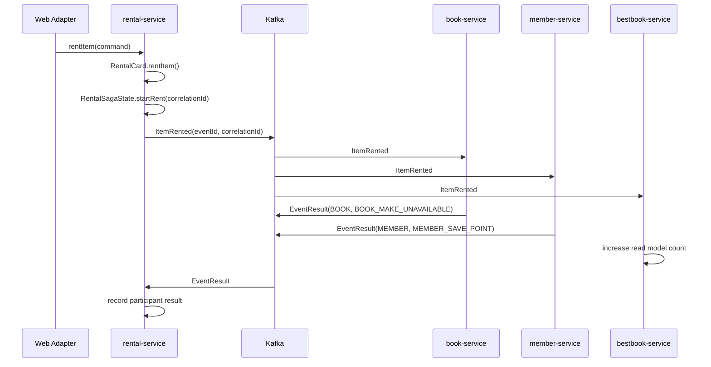

# 순수 MSA + EDA + Choreography SAGA 재사용 지침서

이 문서는 MSA 서비스 경계, Kafka 기반 EDA, Choreography SAGA, 결과 이벤트 계약, 멱등 Consumer, 보상 트랜잭션, event-maintained read model 패턴을 다른 프로젝트의 `AGENTS.md`나 AI 프롬프트 기준으로 바로 사용할 수 있게 정리한 재사용 지침서다.

범위는 순수 MSA, EDA, Choreography SAGA 코드 작성 방식이다. 목표는 "서비스는 자기 도메인과 데이터를 소유한다", "서비스 간 상태 변경은 메시지로만 연결한다", "도메인 이벤트와 통합 메시지를 분리한다", "비동기 흐름은 `correlationId`로 추적한다", "중복 메시지와 중복 보상을 분리해서 막는다", "보상은 물리적 rollback이 아니라 업무적 역행위로 처리한다"를 코드 수준에서 명확히 전달하는 것이다.

이 문서의 예시는 도서 대여 도메인을 사용해 문서 안에 직접 작성한 Java 예제다. 다른 프로젝트에서 이 지침서를 사용할 때 별도 저장소나 파일을 열지 않아도 의미가 통해야 한다.

도서 대여 예제를 설명할 때도 `Book.makeUnAvailable()` 같은 짧은 인라인 예시만 던지지 않는다. 반드시 클래스/record 이름과 메서드 코드가 들어 있는 자체 완결 예제로 풀어 쓴다. 표와 요약은 방향을 잡는 용도이고, 판단의 근거는 이 문서 안의 Java 코드 블록이 담당한다.

## 예제 작성 방식

이 지침서는 특정 저장소 위치를 찾아가라는 문서가 아니다. 다른 프로젝트에서 그대로 읽어도 구현 방향이 보이도록, 예제는 Java 타입과 핵심 메서드를 문서 안에 직접 적는다.

좋은 예:

```java
import java.time.Instant;

public record ItemRented(
    String eventId,
    String correlationId,
    Instant occurredAt,
    String memberId,
    String memberName,
    Long itemNo,
    String itemTitle,
    long point
) {
}
```

나쁜 예:

```java
// 공유 계약이 service-local domain VO를 직접 들고 다니면 다른 프로젝트에서 재사용할 수 없다.
public record ItemRented(
    RentalMember member,
    RentalItem item,
    long point
) {
}
```

## 사용 방법

1. 새 프로젝트의 MSA/EDA/SAGA 구조를 설계할 때 이 문서의 Java 예제 코드를 기준으로 삼는다.
2. 같은 패턴을 추가하거나 리뷰할 때 먼저 이 문서의 자체 완결 예제를 읽는다.
3. 아래 도서 대여 예제 섹션을 참고해 command/event/result/compensation 흐름을 같은 구조로 작성한다.
4. 구현 후 메시지 계약 테스트, Consumer 멱등성 테스트, SAGA 상태 테스트, 관련 ArchUnit 테스트로 규칙을 고정한다.

---

# Style Commerce EDA/SAGA 적용 가이드

이 섹션은 `plan/style-commerce-eda-plan.md`의 BE 기획을 이 Pure MSA + EDA + Choreography SAGA 지침서에 적용한 프로젝트별 기준이다. 아래 기준은 `style-commerce-eda`의 Kafka 계약, 주문 SAGA, 보상 흐름, read model 갱신, 로컬 이미지 이벤트 처리에 우선 적용한다.

## 1. 서비스 경계

| 서비스 | 업무 능력 | DB/저장소 | SAGA 역할 |
| --- | --- | --- | --- |
| `catalog-service` | 브랜드, 상품, SKU, 가격, 이미지 metadata | MariaDB + local file storage | 상품/이미지 변경 event producer |
| `cart-service` | 장바구니와 주문 전 상품 snapshot | Redis/MariaDB | SAGA 참여 없음 |
| `order-service` | 주문 생성, 주문 상태, 주문 SAGA 상태 | MariaDB | initiating service |
| `inventory-service` | SKU 재고, 재고 예약/해제 | MariaDB | participant |
| `payment-service` | 결제 승인/취소 mock | MariaDB | participant |
| `delivery-service` | 배송 생성/취소 mock | MariaDB | participant |
| `display-service` | 홈/기획전/브랜드 피드 read model | MongoDB | event-maintained read model |
| `member-service` | 회원, 주소록, 멤버십, 포인트 | MariaDB | Phase 2 participant |

서비스 간 상태 변경은 Kafka command/result/event로만 연결한다. `order-service`는 상품, 재고, 결제, 배송 DB를 직접 읽지 않는다. `display-service`는 catalog DB를 직접 조회하지 않고 상품/가격/이미지/재고 이벤트로 projection을 유지한다.

## 2. common-events 계약

`common-events`는 공유 domain model이 아니라 integration message contract 전용 모듈이다.

```text
common-events/
└── src/main/java/com/example/style/common/event/
    ├── CommandMessage.java
    ├── DomainEventMessage.java
    ├── ResultEventMessage.java
    ├── OrderEventType.java
    ├── Participant.java
    ├── SagaStep.java
    ├── StockReserveCommand.java
    ├── StockReservationResult.java
    ├── PaymentAuthorizeCommand.java
    ├── PaymentAuthorizationResult.java
    ├── DeliveryPrepareCommand.java
    ├── DeliveryPreparationResult.java
    ├── StockReleaseCommand.java
    ├── StockReleaseResult.java
    ├── PaymentCancelCommand.java
    ├── PaymentCancelResult.java
    ├── DeliveryCancelCommand.java
    ├── DeliveryCancelResult.java
    ├── OrderConfirmed.java
    ├── OrderCanceled.java
    ├── ProductPublished.java
    ├── ProductPriceChanged.java
    ├── ProductImageChanged.java
    └── StockSoldOut.java
```

모든 command/result/event는 다음 metadata를 가진다.

| 필드 | 의미 |
| --- | --- |
| `eventId` | 메시지 자체 고유 ID |
| `correlationId` | 하나의 주문/취소/보상 흐름 ID |
| `sourceEventId` | 원인이 된 메시지 ID |
| `occurredAt` | 메시지 생성 시각 |
| `eventType` | `ORDER`, `CANCEL`, `RETURN` 등 흐름 타입 |
| `participant` | 결과 발행 또는 처리 참여자 |
| `step` | SAGA 처리 단계 |

Result Event는 항상 새 `eventId`를 만든다. 처리한 원본 command의 `eventId`는 `sourceEventId`에 보존한다.

## 3. Protocol enum

```java
public enum OrderEventType {
    ORDER,
    CANCEL,
    RETURN
}
```

```java
public enum Participant {
    ORDER,
    INVENTORY,
    PAYMENT,
    DELIVERY,
    MEMBER,
    PROMOTION
}
```

```java
public enum SagaStep {
    ORDER_PLACE,
    STOCK_RESERVE,
    STOCK_RELEASE,
    PAYMENT_AUTHORIZE,
    PAYMENT_CANCEL,
    DELIVERY_PREPARE,
    DELIVERY_CANCEL,
    ORDER_CONFIRM,
    ORDER_CANCEL
}
```

이 enum은 여러 서비스가 같은 메시지를 해석하기 위한 protocol vocabulary다. 개별 서비스의 domain enum과 섞지 않는다.

## 4. Command 메시지

### 4.1 StockReserveCommand

```java
import java.time.Instant;
import java.util.List;

public record StockReserveCommand(
    String eventId,
    String correlationId,
    String sourceEventId,
    Instant occurredAt,
    String orderId,
    String memberId,
    List<OrderLineSnapshot> lines
) implements CommandMessage {
}
```

### 4.2 PaymentAuthorizeCommand

```java
import java.time.Instant;

public record PaymentAuthorizeCommand(
    String eventId,
    String correlationId,
    String sourceEventId,
    Instant occurredAt,
    String orderId,
    String memberId,
    long amount,
    PaymentMethod method
) implements CommandMessage {
}
```

### 4.3 DeliveryPrepareCommand

```java
import java.time.Instant;
import java.util.List;

public record DeliveryPrepareCommand(
    String eventId,
    String correlationId,
    String sourceEventId,
    Instant occurredAt,
    String orderId,
    String memberId,
    ShippingAddressSnapshot shippingAddress,
    List<OrderLineSnapshot> lines
) implements CommandMessage {
}
```

### 4.4 Compensation command

보상 command도 새 `eventId`를 가진다. `correlationId`는 원래 주문 흐름의 값을 유지한다.

```java
public record StockReleaseCommand(
    String eventId,
    String correlationId,
    String sourceEventId,
    Instant occurredAt,
    String orderId,
    List<OrderLineSnapshot> lines,
    String reason
) implements CommandMessage {
}
```

```java
public record PaymentCancelCommand(
    String eventId,
    String correlationId,
    String sourceEventId,
    Instant occurredAt,
    String orderId,
    String paymentId,
    long amount,
    String reason
) implements CommandMessage {
}
```

```java
public record DeliveryCancelCommand(
    String eventId,
    String correlationId,
    String sourceEventId,
    Instant occurredAt,
    String orderId,
    String shipmentId,
    String reason
) implements CommandMessage {
}
```

## 5. Result 메시지

```java
public record StockReservationResult(
    String eventId,
    String correlationId,
    String sourceEventId,
    Instant occurredAt,
    OrderEventType eventType,
    Participant participant,
    SagaStep step,
    boolean successed,
    String orderId,
    List<OrderLineSnapshot> lines,
    String reason
) implements ResultEventMessage {
}
```

```java
public record PaymentAuthorizationResult(
    String eventId,
    String correlationId,
    String sourceEventId,
    Instant occurredAt,
    OrderEventType eventType,
    Participant participant,
    SagaStep step,
    boolean successed,
    String orderId,
    String paymentId,
    long amount,
    String reason
) implements ResultEventMessage {
}
```

```java
public record DeliveryPreparationResult(
    String eventId,
    String correlationId,
    String sourceEventId,
    Instant occurredAt,
    OrderEventType eventType,
    Participant participant,
    SagaStep step,
    boolean successed,
    String orderId,
    String shipmentId,
    String trackingNumber,
    String reason
) implements ResultEventMessage {
}
```

실패 result도 반드시 발행한다. 실패를 로그만 남기고 삼키면 initiating service가 SAGA 상태를 수렴시킬 수 없다.

## 6. Snapshot payload

메시지는 service-local domain VO를 공유하지 않고 primitive/simple snapshot field를 사용한다.

```java
public record OrderLineSnapshot(
    Long skuId,
    Long productId,
    String brandName,
    String productName,
    String color,
    String size,
    int quantity,
    long unitPrice,
    String thumbnailUrl
) {
}
```

```java
public record ShippingAddressSnapshot(
    String receiverName,
    String zipCode,
    String address1,
    String address2,
    String phone
) {
}
```

이미지 URL도 snapshot field다. 단, 로컬 절대 경로가 아니라 FE가 접근할 수 있는 public URL 또는 상대 URL을 사용한다.

## 7. Kafka Topic 설계

| Topic | Producer | Consumer | 메시지 |
| --- | --- | --- | --- |
| `style.order.command.stock-reserve` | order | inventory | `StockReserveCommand` |
| `style.inventory.result.stock-reservation` | inventory | order | `StockReservationResult` |
| `style.order.command.payment-authorize` | order | payment | `PaymentAuthorizeCommand` |
| `style.payment.result.authorization` | payment | order | `PaymentAuthorizationResult` |
| `style.order.command.delivery-prepare` | order | delivery | `DeliveryPrepareCommand` |
| `style.delivery.result.preparation` | delivery | order | `DeliveryPreparationResult` |
| `style.order.command.stock-release` | order | inventory | `StockReleaseCommand` |
| `style.inventory.result.stock-release` | inventory | order | `StockReleaseResult` |
| `style.order.command.payment-cancel` | order | payment | `PaymentCancelCommand` |
| `style.payment.result.cancel` | payment | order | `PaymentCancelResult` |
| `style.order.command.delivery-cancel` | order | delivery | `DeliveryCancelCommand` |
| `style.delivery.result.cancel` | delivery | order | `DeliveryCancelResult` |
| `style.order.event.confirmed` | order | display, member, notification | `OrderConfirmed` |
| `style.order.event.canceled` | order | display, notification | `OrderCanceled` |
| `style.catalog.event.product-published` | catalog | display | `ProductPublished` |
| `style.catalog.event.price-changed` | catalog | display, cart | `ProductPriceChanged` |
| `style.catalog.event.image-changed` | catalog | display, cart | `ProductImageChanged` |
| `style.inventory.event.stock-sold-out` | inventory | display, catalog | `StockSoldOut` |

Kafka key:

- 주문 관련 command/result/event: `orderId`
- 주문 SAGA ordering이 더 중요하면 `correlationId`
- 상품 관련 event: `productId`
- SKU 재고 event: `skuId`
- 브랜드 event: `brandId`

## 8. 주문 SAGA

### 8.1 정상 흐름

```text
1. FE -> order-service: POST /api/v1/orders
2. order-service: Order.place(), OrderSagaState.start()
3. order-service -> FE: 202 Accepted(orderId, correlationId)
4. order-service -> inventory-service: StockReserveCommand
5. inventory-service: StockItem.reserve()
6. inventory-service -> order-service: StockReservationResult(success)
7. order-service: markStockReserved()
8. order-service -> payment-service: PaymentAuthorizeCommand
9. payment-service: Payment.authorize()
10. payment-service -> order-service: PaymentAuthorizationResult(success)
11. order-service: markPaymentAuthorized()
12. order-service -> delivery-service: DeliveryPrepareCommand
13. delivery-service: Shipment.prepare()
14. delivery-service -> order-service: DeliveryPreparationResult(success)
15. order-service: Order.confirm()
16. order-service -> Kafka: OrderConfirmed
```

### 8.2 재고 예약 실패

```text
StockReserveCommand
-> StockReservationResult(failure)
-> order-service: Order.fail(OUT_OF_STOCK)
-> OrderFailed event
```

보상 없음. 결제와 배송은 시작하지 않는다.

### 8.3 결제 승인 실패

```text
StockReservationResult(success)
-> PaymentAuthorizeCommand
-> PaymentAuthorizationResult(failure)
-> order-service: Order.startCancel(PAYMENT_FAILED)
-> StockReleaseCommand
-> StockReleaseResult(success)
-> order-service: Order.cancel()
-> OrderCanceled event
```

성공이 확인된 참여자는 inventory뿐이므로 `StockReleaseCommand`만 발행한다. payment는 승인 실패 상태이므로 `PaymentCancelCommand`를 발행하지 않는다.

### 8.4 배송 생성 실패

```text
StockReservationResult(success)
-> PaymentAuthorizationResult(success)
-> DeliveryPrepareCommand
-> DeliveryPreparationResult(failure)
-> order-service: Order.startCancel(DELIVERY_FAILED)
-> PaymentCancelCommand
-> PaymentCancelResult(success)
-> StockReleaseCommand
-> StockReleaseResult(success)
-> order-service: Order.cancel()
-> OrderCanceled event
```

성공이 확인된 참여자는 inventory와 payment다. delivery는 실패했으므로 delivery cancel을 발행하지 않는다.

### 8.5 고객 주문 취소

취소 가능 조건:

- 주문 상태가 `CONFIRMED`
- 배송 상태가 `PREPARING` 또는 `READY`
- 배송이 `SHIPPING` 이후이면 Phase 2의 claim/return 흐름으로 전환

흐름:

```text
POST /api/v1/orders/{orderId}/cancel
-> order-service: Order.startCancel(CUSTOMER_REQUEST)
-> DeliveryCancelCommand
-> DeliveryCancelResult(success)
-> PaymentCancelCommand
-> PaymentCancelResult(success)
-> StockReleaseCommand
-> StockReleaseResult(success)
-> order-service: Order.cancel()
-> OrderCanceled event
```

## 9. OrderSagaState

```text
order_saga_state
├── id
├── order_id
├── correlation_id
├── saga_type
├── saga_status
├── stock_result
├── payment_result
├── delivery_result
├── last_failure_reason
├── started_at
└── updated_at
```

상태 값:

```text
SagaStatus:
STARTED
COMPLETED
COMPENSATING
COMPENSATED
FAILED
NEEDS_MANUAL_REVIEW

ParticipantResult:
PENDING
SUCCESS
FAILED
COMPENSATED
```

보상 판단표:

| 실패 단계 | stock | payment | delivery | 보상 |
| --- | --- | --- | --- | --- |
| 재고 예약 실패 | FAILED | PENDING | PENDING | 없음 |
| 결제 승인 실패 | SUCCESS | FAILED | PENDING | 재고 예약 해제 |
| 배송 생성 실패 | SUCCESS | SUCCESS | FAILED | 결제 취소, 재고 예약 해제 |
| 배송 취소 실패 | SUCCESS | SUCCESS | FAILED | `NEEDS_MANUAL_REVIEW` |
| 결제 취소 실패 | SUCCESS | FAILED | SUCCESS | `NEEDS_MANUAL_REVIEW` |
| 재고 해제 실패 | FAILED | COMPENSATED | FAILED | `NEEDS_MANUAL_REVIEW` |

원칙:

- 성공이 확인된 참여자만 보상한다.
- `PENDING` 참여자를 실패로 단정하지 않는다.
- 늦게 성공 result가 오면 현재 SAGA 상태를 보고 추가 보상 또는 무시를 결정한다.
- timeout은 자동 보상보다 먼저 `NEEDS_MANUAL_REVIEW`로 표시한다.

## 10. 멱등성

### 10.1 Message idempotency

각 consumer는 service-local `processed_message` 저장소를 가진다.

```text
processed_message
├── id
├── service_name
├── event_id
├── correlation_id
├── message_type
├── processed_at
└── unique(service_name, event_id)
```

처리 순서:

```text
1. application service transaction 시작
2. processed_message insert 시도
3. unique 위반이면 이미 처리된 메시지로 보고 종료
4. aggregate 상태 변경
5. aggregate 저장
6. service-local domain event pull
7. outbound port로 result/event 발행
8. transaction 종료
```

Redis `hasKey -> business -> set` 흐름은 사용하지 않는다. Redis를 쓰더라도 짧은 processing claim으로 제한한다.

### 10.2 Compensation idempotency

보상 record:

```text
compensation_record
├── id
├── correlation_id
├── compensation_type
├── order_id
├── compensated_at
└── unique(correlation_id, compensation_type)
```

CompensationType:

```text
STOCK_RELEASE
PAYMENT_CANCEL
DELIVERY_CANCEL
COUPON_RELEASE
POINT_RESTORE
```

message idempotency는 `eventId` 기준이고 compensation idempotency는 `correlationId + compensationType` 기준이다. 둘을 섞지 않는다.

## 11. 로컬 이미지와 EDA 규칙

MVP는 이미지 파일 서버, S3, CDN 없이 `catalog-service`의 local file storage와 `/assets/**` 정적 리소스 매핑으로 이미지를 제공한다. 이 로컬 구현은 technical adapter이며 EDA 메시지 계약을 오염시키면 안 된다.

### 11.1 이벤트에 넣는 것

상품/전시 read model 갱신에 필요한 이벤트에는 이미지 metadata snapshot만 넣는다.

```java
public record ProductPublished(
    String eventId,
    String correlationId,
    String sourceEventId,
    Instant occurredAt,
    Long productId,
    Long brandId,
    String brandName,
    String productName,
    String category,
    long salePrice,
    String thumbnailUrl
) implements DomainEventMessage {
}
```

```java
public record ProductImageChanged(
    String eventId,
    String correlationId,
    String sourceEventId,
    Instant occurredAt,
    Long productId,
    String representativeImageUrl,
    String altText
) implements DomainEventMessage {
}
```

### 11.2 이벤트에 넣지 않는 것

- 이미지 binary
- Base64 image string
- `C:\workspace\...` 같은 로컬 절대 경로
- Multipart metadata 전체
- storage adapter 내부 key 중 다른 서비스가 해석할 필요 없는 값

### 11.3 read model 반영

`display-service`는 `ProductPublished`, `ProductPriceChanged`, `ProductImageChanged`, `StockSoldOut`를 소비해 `DisplayProductDocument`를 갱신한다.

```text
DisplayProductDocument
├── productId
├── brandId
├── brandName
├── productName
├── category
├── salePrice
├── thumbnailUrl
├── badges
├── available
└── updatedAt
```

이미지 파일이 로컬에 없거나 URL이 깨져도 read model 이벤트 처리는 실패하지 않는다. 이미지 존재 검증은 catalog-service upload/use case에서 처리하고, display-service는 URL snapshot만 반영한다.

### 11.4 local profile 운영

로컬에서는 다음 URL 형태를 사용한다.

```text
http://localhost:8081/assets/images/products/{productId}/{imageKey}.webp
```

FE가 API Gateway를 쓰는 경우에는 다음처럼 gateway 경유 URL로 통일할 수 있다.

```text
http://localhost:8080/catalog/assets/images/products/{productId}/{imageKey}.webp
```

어느 방식을 쓰든 이벤트에는 FE가 접근 가능한 public URL만 담고, 파일 시스템 경로는 담지 않는다.

## 12. 구현 순서

1. `common-events` protocol enum, command, result, snapshot record 설계
2. `order-service`의 `Order`, `OrderSagaState`, 주문 생성 API 구현
3. `inventory-service` 재고 예약/해제 command consumer와 result producer 구현
4. `payment-service` mock 승인/취소 command consumer와 result producer 구현
5. `delivery-service` mock 배송 생성/취소 command consumer와 result producer 구현
6. `order-service` result consumer와 보상 command 발행 구현
7. `catalog-service` 상품/이미지 metadata event 발행 구현
8. `display-service` 상품/이미지/재고 이벤트 projection 구현
9. 정상 주문, 재고 실패, 결제 실패, 배송 실패, 고객 취소 통합 테스트 구현

---

## 예제 흐름 요약

이 지침서가 설명해야 하는 핵심은 아래 코드 흐름이다. 따라서 이 문서는 단순히 EDA/SAGA 일반론을 적은 문서가 아니라, 같은 구조를 다른 프로젝트에도 재현할 수 있게 문서 내부 예제로 고정한 지침서여야 한다.

MSA 경계는 application service가 자기 서비스의 port만 바라보는 코드로 드러난다.

예시: `RentalCardService`

```java
@Service
@Transactional
@RequiredArgsConstructor
public class RentalCardService implements CreateRentalCardUseCase, RentItemUseCase, ReturnItemUseCase,
    OverdueItemUseCase, ClearOverdueItemUseCase, RentalCardQueryUseCase {
    private final LoadRentalCardPort        loadRentalCardPort;
    private final SaveRentalCardPort        saveRentalCardPort;
    private final SaveRentalSagaStatePort   saveRentalSagaStatePort;
    private final PublishItemRentedPort     publishItemRentedPort;
    private final PublishItemReturnedPort   publishItemReturnedPort;
    private final PublishOverdueClearedPort publishOverdueClearedPort;
}
```

Domain event는 aggregate 내부 상태 변경 이후 service-local event로만 기록된다.

예시: `RentalCard`

```java
public void rentItem(RentalItem item) {
    if (rentStatus == RentStatus.RENT_UNAVAILABLE) {
        throw new IllegalArgumentException("대여 정지 상태에서는 도서를 대여할 수 없습니다.");
    }
    if (!RentalLimitPolicy.STANDARD.canRent(rentItemList.size())) {
        throw new IllegalArgumentException(
            "대여 중인 도서는 최대 " + RentalLimitPolicy.STANDARD.maxRentalCount() + "권까지 가능합니다."
        );
    }
    if (findRentItem(item) != null) {
        throw new IllegalArgumentException("이미 대여 중인 도서입니다.");
    }
    RentItem rentItem = RentItem.createRentalItem(item);
    rentItemList.add(rentItem);

    registerDomainEvent(
            ItemRentedDomainEvent.of(member, rentItem.item(), RentalPointPolicy.RENT.point())
    );
}
```

Integration message는 outbound adapter에서 Kafka metadata와 Avro payload로 변환된다.

예시: `RentalKafkaEventProducer`

```java
@Override
public void publishRentalEvent(ItemRentedDomainEvent event, String correlationId) {
    ItemRented message = new ItemRented(
        UUID.randomUUID().toString(),
        correlationId,
        event.occurredAt(),
        event.member().id(),
        event.member().name(),
        event.item().no(),
        event.item().title(),
        event.point()
    );
    kafkaTemplate.send(
            topicProperties.rentalRent(),
            message.correlationId(),
            AvroMessageMapper.toItemRentedMessage(message)
    );
}
```

Consumer는 wire payload를 application command로 바꾸고 use case에 위임한다.

예시: `BookEventConsumer`

```java
@KafkaListener(topics = "${app.kafka.topics.rental-rent}", groupId = "${spring.kafka.consumer.group-id}")
public void consumeRent(ItemRentedMessage message) throws Exception {
    ItemRented event = AvroMessageMapper.toItemRented(message);
    handleWithProcessingLock(
            event.eventId(),
            "book rent",
            () -> handleBookRentalEventUseCase.handleRent(toCommand(event))
    );
}
```

Result Event는 새 `eventId`, 원본 `sourceEventId`, 참여자와 단계를 명확히 갖는다.

예시: `EventResult`

```java
public record EventResult(
    String eventId,
    String correlationId,
    String sourceEventId,
    Instant occurredAt,
    EventType eventType,
    Participant participant,
    SagaStep step,
    boolean successed,
    String memberId,
    String memberName,
    Long itemNo,
    String itemTitle,
    long point,
    String reason
) {
    private static EventResult result(
        String sourceEventId,
        String correlationId,
        EventType eventType,
        Participant participant,
        SagaStep step,
        boolean successed,
        String memberId,
        String memberName,
        Long itemNo,
        String itemTitle,
        long point,
        String reason,
        Instant occurredAt
    ) {
        String eventId = UUID.randomUUID().toString();
        validateSnapshot(eventType, memberId, itemNo, itemTitle);
        return new EventResult(
            eventId,
            normalizeCorrelationId(correlationId, eventId),
            sourceEventId,
            occurredAt,
            eventType,
            participant,
            step,
            successed,
            memberId,
            memberName,
            itemNo,
            itemTitle,
            point,
            reason
        );
    }
}
```

Durable message idempotency는 서비스 소유 저장소의 unique key로 처리한다.

예시: `ProcessedMessagePersistenceAdapter`

```java
@Override
public boolean markProcessed(String eventId, String correlationId, InboundMessageType messageType) {
    validate(eventId, messageType);
    try {
        repository.saveAndFlush(
            new ProcessedMessageJpaEntity(serviceName, eventId, correlationId, messageType.name())
        );
        return true;
    } catch (DataIntegrityViolationException ex) {
        return false;
    }
}
```

Business compensation idempotency는 message idempotency와 별도 record로 막는다.

예시: `CompensationRecordPersistenceAdapter`

```java
@Override
@Transactional
public boolean markCompensated(String correlationId, RentalCompensationType compensationType) {
    validate(correlationId, compensationType);
    return repository.insertIgnore(correlationId, compensationType.name()) == 1;
}
```

Read model은 원본 DB를 읽지 않고 이벤트로 자기 projection을 갱신한다.

예시: `BestBookService`

```java
@Override
public void recordRent(RecordBestBookRentCommand command) {
    if (!messageIdempotencyPort.markProcessed(
        command.eventId(),
        command.correlationId(),
        command.messageType()
    )) {
        log.info("skip already processed bestbook eventId={}", command.eventId());
        return;
    }
    BestBook bestBook = findBestBookByItemNoPort.findByItemNo(command.itemNo())
        .map(book -> {
            book.increaseBestBookCount();
            return book;
        })
        .orElseGet(() -> BestBook.registerBestBook(new BestBookItem(command.itemNo(), command.itemTitle())));
    saveBestBookPort.save(bestBook);
}
```

---

# 핵심 재사용 원칙 5가지

## 1. Aggregate-collected Domain Events

Domain event는 application service나 Kafka producer가 임의로 만드는 알림 객체가 아니다. Aggregate가 자기 불변식을 검증하고 상태를 실제로 바꾼 뒤, “이미 일어난 사실”로 내부 event buffer에 기록한다.

좋은 흐름은 다음 순서다.

1. Application service가 command를 service-local VO로 바꾼다.
2. Aggregate behavior를 호출한다.
3. Aggregate가 규칙을 검증하고 상태를 변경한다.
4. Aggregate가 service-local domain event를 내부 buffer에 기록한다.
5. Application service가 aggregate를 저장한다.
6. Application service가 `pullDomainEvents()`로 확정된 event만 꺼낸다.
7. Outbound messaging adapter가 그 event를 shared integration message로 변환한다.

예시: `RentalCard`

```java
public void rentItem(RentalItem item) {
    validateRentAvailable();
    validateRentalLimit();
    validateNotAlreadyRented(item);

    RentItem rentItem = RentItem.createRentalItem(item);
    rentItemList.add(rentItem);

    registerDomainEvent(
        ItemRentedDomainEvent.of(member, rentItem.item(), RentalPointPolicy.RENT.point())
    );
}

private void registerDomainEvent(RentalDomainEvent event) {
    domainEvents.add(event);
}

public List<RentalDomainEvent> pullDomainEvents() {
    List<RentalDomainEvent> events = List.copyOf(domainEvents);
    domainEvents.clear();
    return events;
}
```

이 원칙에서 중요한 점은 세 가지다.

- Domain event payload는 caller가 넘긴 raw input보다 aggregate가 확정한 내부 상태를 기준으로 만든다.
- Service-local domain event에는 `eventId`, `correlationId`, topic, Avro class, Kafka metadata가 들어가지 않는다.
- Persistence restoration이나 조회용 재구성은 과거 event를 다시 등록하지 않는다. Event는 새 상태 변경이 실제로 일어난 순간에만 기록한다.

나쁜 예:

```java
public void rentItem(RentalItem item, String eventId, String correlationId) {
    rentItemList.add(RentItem.createRentalItem(item));
    domainEvents.add(new ItemRented(eventId, correlationId, item.no(), item.title()));
}
```

위 코드는 aggregate가 통합 메시지 metadata를 알아버리고, service-local domain event와 Kafka message의 경계를 무너뜨린다.

## 2. 멱등성의 이중 보장

Kafka consumer 멱등성은 한 장치만으로 끝내지 않는다. 짧은 시간의 동시 처리를 줄이는 processing lock과, 재전달 이후에도 남는 durable processed-message record를 분리한다.

첫 번째 보장은 processing lock이다. 같은 `eventId`를 여러 consumer instance가 동시에 처리하려는 상황을 줄인다.

예시: `BookEventConsumer`

```java
private ProcessingClaimResult tryAcquireProcessingLock(String eventId) {
    String key = processingKey(eventId);
    return Boolean.TRUE.equals(
        redisTemplate.opsForValue().setIfAbsent(key, UUID.randomUUID().toString(), processingProperties.ttl())
    ) ? ProcessingClaimResult.CLAIMED : ProcessingClaimResult.ALREADY_PROCESSING;
}
```

두 번째 보장은 service-owned durable idempotency record다. 메시지 처리가 끝난 뒤에도 DB unique key가 남아, 재전달이나 재시작 이후 중복 처리를 막는다.

예시: `MessageIdempotencyPersistenceAdapter`

```java
public boolean markProcessed(String eventId, String correlationId, InboundMessageType messageType) {
    try {
        repository.saveAndFlush(
            new ProcessedMessageJpaEntity(serviceName, eventId, correlationId, messageType.name())
        );
        return true;
    } catch (DataIntegrityViolationException ex) {
        return false;
    }
}
```

이중 보장의 역할은 다르다.

| 장치 | 기준 key | 목적 | 실패/재시작 뒤에도 남는가 |
| --- | --- | --- | --- |
| processing lock | `eventId` 기반 temporary key | 동시에 같은 메시지를 처리하는 일을 줄임 | 아니다 |
| processed-message record | `serviceName + eventId` unique key | 이미 처리한 메시지의 재처리를 막음 | 그렇다 |

Consumer는 lock을 잡은 뒤 application use case에 위임하고, use case는 durable idempotency를 먼저 확인한다. Lock을 잡았다고 이미 처리된 메시지라고 판단하지 않는다.

## 3. `correlationId`로 SAGA 흐름 묶기

`eventId`는 메시지 하나의 ID이고, `correlationId`는 하나의 비동기 업무 흐름 전체를 묶는 ID다. SAGA 흐름을 읽을 때는 `eventId`로 흐름을 묶지 않는다.

대여 예제의 흐름은 다음처럼 이어진다.

```text
RentItemCommand
  -> ItemRented(eventId=A, correlationId=R)
  -> EventResult(eventId=B, sourceEventId=A, correlationId=R, participant=BOOK)
  -> EventResult(eventId=C, sourceEventId=A, correlationId=R, participant=MEMBER)
  -> PointUseCommand(eventId=D, correlationId=R)
  -> ItemRentCanceled(eventId=E, correlationId=R)
```

규칙은 단순하다.

- Initiating service가 비동기 흐름을 시작할 때 새 `correlationId`를 만든다.
- 그 흐름에서 파생되는 domain event, result event, compensation command/event는 같은 `correlationId`를 유지한다.
- Result event는 자기 `eventId`를 새로 만들고, 처리한 메시지 ID는 `sourceEventId`에 둔다.
- Kafka key는 흐름 단위 ordering이 중요하면 `correlationId`를 우선 사용한다.
- Local SAGA state는 `correlationId` 기준으로 조회하고 갱신한다.

예시: `RentalCardService`

```java
String correlationId = UUID.randomUUID().toString();
saveRentalSagaStatePort.save(
    RentalSagaState.startRent(correlationId, event.member(), event.item(), event.point())
);
publishItemRentedPort.publishRentalEvent(event, correlationId);
```

예시: `EventResult`

```java
return new EventResult(
    UUID.randomUUID().toString(),
    correlationId,
    sourceEventId,
    occurredAt,
    eventType,
    participant,
    step,
    successed,
    memberId,
    memberName,
    itemNo,
    itemTitle,
    point,
    reason
);
```

## 4. 보상의 멱등성

보상은 메시지 멱등성과 별도로 막는다. 이미 처리한 `EventResult`를 막는 것과, 같은 업무 보상을 두 번 실행하지 않는 것은 다른 문제다.

보상 멱등성 key는 `eventId`가 아니라 `correlationId + compensationType`처럼 업무 의미를 포함해야 한다.

예시: `CompensationRecordPersistenceAdapter`

```java
public boolean markCompensated(String correlationId, RentalCompensationType compensationType) {
    return repository.insertIgnore(correlationId, compensationType.name()) == 1;
}
```

예시: `RentalCompensationType`

```java
public enum RentalCompensationType {
    RENT_CANCEL,
    RENT_POINT_USE,
    RETURN_CANCEL,
    RETURN_POINT_USE,
    OVERDUE_CLEAR_CANCEL
}
```

보상은 두 단계에서 멱등적이어야 한다.

- Application layer: `correlationId + compensationType` 기록으로 같은 업무 보상을 한 번만 시작한다.
- Domain layer: `cancelRentItem(...)`, `cancelReturnItem(...)` 같은 aggregate behavior가 이미 되돌릴 대상이 없으면 조용히 종료한다.

예시: `RentalCard`

```java
public RentalCard cancelRentItem(RentalItem item) {
    RentItem rentItem = findRentItem(item);
    if (rentItem == null) {
        return this;
    }
    rentItemList.remove(rentItem);
    registerDomainEvent(
        ItemRentCanceledDomainEvent.of(member, rentItem.item(), RentalPointPolicy.RENT.point())
    );
    return this;
}
```

이렇게 해야 서로 다른 실패 결과가 뒤늦게 여러 번 도착해도 같은 업무 보상은 한 번만 실행되고, 이미 보상된 aggregate 상태에서 중복 compensation event가 발행되지 않는다.

## 5. 발신자가 아닌 메시지 계약으로 사고

EDA에서는 “누가 보냈는가”보다 “이 메시지가 어떤 계약이며 어떤 사실/요청/결과를 뜻하는가”가 먼저다. Consumer는 발신 서비스의 내부 사정을 추측하지 않고, 공유 메시지 계약을 해석해 자기 use case로 변환한다.

좋은 사고 방식:

| 메시지 | 계약으로 보는 의미 | Consumer의 판단 |
| --- | --- | --- |
| `ItemRented` | 어떤 회원이 어떤 도서를 대여했다는 확정 사실 | 도서는 대여 불가로 바꾸고, 회원은 포인트를 적립하고, read model은 카운트를 올린다 |
| `PointUseCommand` | 특정 회원 포인트 차감을 요청하는 command | 회원 서비스가 포인트 차감 가능 여부를 자기 규칙으로 판단한다 |
| `EventResult` | 참여 서비스의 처리 결과 | initiating service가 `Participant`, `SagaStep`, `successed`로 SAGA 상태를 갱신한다 |
| `ItemRentCanceled` | 대여 취소 보상이 확정됐다는 사실 | 도서와 read model이 반대 방향으로 projection을 맞춘다 |

나쁜 사고 방식:

```java
if (message.senderName().equals("some-sender")) {
    book.makeUnavailable();
}
```

좋은 사고 방식:

```java
if (event instanceof ItemRented rented) {
    handleBookRentalEventUseCase.handleRent(toCommand(rented));
}
```

메시지 계약 중심 설계의 규칙은 다음과 같다.

- Message 이름이 command, fact, result, compensation fact 중 무엇인지 드러내야 한다.
- Consumer는 producer의 class, 내부 코드 위치, DB, aggregate를 알지 않는다.
- 필요한 cross-service 데이터는 service domain VO가 아니라 snapshot field로 메시지에 담는다.
- Result event에는 발신자 문자열 대신 `Participant`와 `SagaStep` 같은 protocol field를 둔다.
- 같은 메시지를 여러 서비스가 각자 다르게 해석해도 된다. 단, 해석은 메시지 계약과 자기 서비스의 도메인 규칙 안에서만 한다.

---

# MSA + EDA + SAGA AGENTS.md / 프롬프트 템플릿

아래 블록은 MSA + EDA + Choreography SAGA 구현에 재사용할 수 있는 AGENTS/프롬프트 기준이다. 코드 작업 요청이 들어오면 이 문서의 Java 예제와 같은 경계를 유지한다.

````markdown
# Pure MSA + EDA + Choreography SAGA Instructions

## Core Philosophy

- A service is a business capability boundary, not a technical layer split.
- Each service owns its domain model, application use cases, adapters, and persistence model.
- Each service owns its data. Other services must not query or mutate that database directly.
- Service boundaries are strict. Cross-service state changes must use Kafka command/event/result messages only.
- Do not add direct service-to-service HTTP clients such as `RestTemplate`, `WebClient`, or OpenFeign.
- Do not introduce Outbox, DLQ/DLT, distributed tracing, custom Kafka retry/backoff, or centralized SAGA orchestration unless the project explicitly changes its architecture.
- Domain events are facts that already happened inside one service's domain.
- Command messages request another service to do something.
- Result events report whether a command/event was processed successfully by a participant.
- Compensation messages or compensation events represent semantic undo, not physical database rollback.
- Domain/application code must not depend on Avro generated classes, Kafka serializers, topic names, or KafkaTemplate.
- Kafka consumers translate wire payloads into application commands and delegate to use cases.
- Kafka producers translate service-local domain/application events into shared integration messages.
- Every integration message has a unique `eventId`.
- One asynchronous business flow keeps the same `correlationId`.
- A result event creates a new `eventId` and preserves the processed message id as `sourceEventId`.
- Message idempotency and business compensation idempotency are separate concerns.

## MSA Service Boundary Rules

- Split services by bounded context and business ownership, not by controller/service/repository layers.
- A service may share protocol contracts, but must not share aggregate roots, domain value objects, JPA entities, Mongo documents, or repositories.
- `common-events` is a protocol contract module. It is not a shared domain model module.
- Cross-service data needed inside a message must be copied as immutable snapshot fields.
- Cross-service reads should use event-maintained local read models when direct reads would cross ownership boundaries.
- A service-local transaction commits only service-owned state. Other services converge through events, commands, result events, and compensation.
- Failure of one service is part of the design. A caller must not assume distributed all-or-nothing commit.
- Service autonomy matters even in a monorepo: code can share a build, but domain decisions and data ownership remain separate.

## Message Vocabulary

도서 대여 예제에서는 메시지 목적마다 이름을 분리한다.

| Type | Meaning | Example Naming |
| --- | --- | --- |
| Domain Event | A fact confirmed by an aggregate | `ItemRented`, `BookMadeUnavailable`, `MemberPointSaved` |
| Command Message | A request to do work in another service | `PointUseCommand` |
| Result Event | A participant's success/failure report | `EventResult` |
| Compensation Event | A fact that a semantic undo happened | `ItemRentCanceled`, `OverdueClearCanceled` |

Do not use one generic event for every purpose. The name must reveal whether the message is a request, a fact, a result, or a compensation fact.

## Shared Contract Rules

- Shared command/event/result contracts used by multiple services belong in a contracts module such as `common-events`.
- Shared messages should use primitive/simple snapshot fields, not service domain value objects.
- Do not place service domain VOs in the shared contracts module.
- Java record facades are used at application boundaries.
- Avro or Schema Registry generated classes stay inside Kafka adapters and schema mappers.
- Generated Avro JavaBean accessors may be used only inside Kafka adapters or schema mappers.
- Application/domain code accesses records through canonical accessors such as `eventId()`, `correlationId()`, and `sourceEventId()`.
- Application messaging commands may use shared protocol enums such as `EventType`, `Participant`, and `SagaStep` when those enums are part of the inter-service contract.
- Domain models must not depend on shared integration message records, Avro generated classes, topic names, or Kafka concerns.

## Event Identity Rules

- `eventId`: unique ID of the current integration message.
- `correlationId`: ID of the whole asynchronous business flow.
- `sourceEventId`: ID of the message that caused the current result event.
- A participant result event must not reuse the source message's `eventId`.
- A compensation command must create a new `eventId` and preserve the original `correlationId`.
- Kafka partition keys should use `correlationId` when ordering within one flow matters.
- Local SAGA state should be loaded and updated by `correlationId`, not by one participant message id.
- A single SAGA flow should keep the same `correlationId` across domain events, result events, compensation commands, and compensation events.

## Aggregate-Collected Domain Event Rules

- Aggregate roots collect service-local domain events after state changes are confirmed.
- Domain events represent facts that happened inside an aggregate, not incoming requests.
- Domain event payloads should come from aggregate-confirmed state.
- Domain event buffers must be pulled through a method such as `pullDomainEvents()`.
- Pulling domain events must clear the buffer to avoid duplicate publication.
- Restoring an aggregate from persistence must not register old domain events.
- Service-local domain events must not include integration metadata such as `eventId`, `correlationId`, topic names, participant names, SAGA steps, Avro payloads, or Kafka concerns.

## Producer Rules

- Application services call outbound ports, not `KafkaTemplate`.
- Producer adapters implement outbound ports under `adapter/out/messaging`.
- Producer adapters add integration metadata such as `eventId`, `correlationId`, `occurredAt`, topic, and Avro conversion.
- Producer adapters convert service-local domain events to shared messages.
- Domain aggregates never create shared Kafka messages.

## Contract-First Message Rules

- Think from the shared message contract, not from the sending service.
- Message names must reveal whether they are commands, facts, result events, or compensation facts.
- Consumers must not branch on sender names or producer implementation details.
- Consumers translate shared messages into their own application commands and apply their own domain rules.
- Shared messages carry primitive/simple snapshot fields, not service-local domain value objects.
- Result events identify participant and step through protocol fields such as `Participant` and `SagaStep`, not by guessing from topic or sender.

## Consumer Rules

- Consumers live under `adapter/in/messaging/consumer`.
- Consumers deserialize wire payloads, minimally validate, convert to application commands, and delegate to use cases.
- Business decisions do not live in consumers.
- Redis `SETNX` or `setIfAbsent` style locks are processing locks only.
- Durable processed-message records belong to the service-owned database.
- Processed-message uniqueness should be based on `serviceName + eventId`.
- If processing fails, release the short-lived processing lock so redelivery can retry.
- Idempotency needs two layers: a short-lived processing lock for concurrent delivery and a durable processed-message record for redelivery/restart.
- A processing lock must not be treated as proof that a message has already been successfully processed.

## Choreography SAGA Rules

- No central SAGA orchestrator. Each service reacts to events it owns and publishes events/results.
- The initiating service may keep local SAGA state by `correlationId` to interpret participant results.
- Track participant results separately when more than one participant can succeed or fail.
- Compensate only participants whose success is confirmed.
- A pending participant must not be compensated until it later reports success.
- If timeout handling is needed, prefer local monitoring and manual-review state first; automatic timeout compensation is a separate design decision.
- Compensation is semantic undo through aggregate behavior such as `RentalCard.cancelRentItem(RentalItem item)`, `RentalCard.cancelReturnItem(RentalItem item, long point)`, and `RentalCard.cancelMakeAvailableRental(long point)`, not DB rollback.
- Compensation behavior must be idempotent.
- Use a separate compensation idempotency key such as `correlationId + compensationType`.
- Compensation idempotency is separate from message idempotency.
- Compensation should be idempotent at both the application layer and the aggregate behavior layer.
- Only participants with confirmed success should be compensated.

## Read Model Rules

- Event-maintained read models consume domain events and update their own storage.
- Read models do not publish SAGA participant results unless they are actual participants in the transactional workflow.
- Compensation events should update read models in the opposite direction.
- In the library rental example, `ItemRented` increments a best-book counter and `ItemRentCanceled` decrements it.

## Module And Layer Shape

```text
contracts-module
├── ItemRented
├── ItemReturned
├── ItemRentCanceled
├── ItemReturnCanceled
├── OverdueCleared
├── OverdueClearCanceled
├── PointUseCommand
├── EventResult
├── EventType
├── Participant
├── SagaStep
├── InboundMessageType
├── PointUseReason
└── AvroMessageMapper

rental-service
├── domain/event
├── domain/model
├── domain/model/saga
├── domain/vo
├── application/dto
├── application/port/in
├── application/port/out
├── application/service
├── adapter/in/messaging/consumer
├── adapter/out/messaging
└── adapter/out/persistence

book-service
member-service
bestbook-service
└── same layered shape with service-owned domain/application/adapter code
```

## Anti-Patterns

- Consumer directly mutates repositories instead of delegating to an application use case.
- Application service sends Kafka messages through `KafkaTemplate`.
- Domain aggregate imports `common-events` or Avro generated classes.
- One service imports another service's domain model, JPA entity, Mongo document, repository, or application service.
- A shared module grows into a common domain model library.
- Several services write the same table, collection, or aggregate state.
- Result event reuses the source message `eventId`.
- Failure path only logs or throws and never publishes a failure result.
- `correlationId + eventType` is the only compensation key when several compensation types exist.
- Redis processing lock is treated as the final idempotency source.
- Read model compensation is forgotten, leaving projections inconsistent.
- Command, event, result, and compensation messages share vague names such as `EventMessage` or `ProcessEvent`.
````

---

# MSA 원칙과 정수

MSA의 정수는 "작게 나눈다"가 아니다. "업무 책임과 데이터 소유권을 기준으로 독립적인 변경 단위를 만든다"가 핵심이다. 서비스가 많아져도 한 서비스가 다른 서비스의 DB, domain model, repository, application service를 직접 알면 분산 모놀리스가 된다.

도서 대여 예제에서 서비스 경계는 다음처럼 읽힌다.

| 서비스 | 소유 도메인 | 소유 저장소 | 외부에 알리는 것 | 외부에서 받는 것 |
| --- | --- | --- | --- | --- |
| `rental-service` | 대여카드, 대여/반납/연체, SAGA 상태 | MariaDB `RentalCard`, `RentalSagaState`, processed/compensation records | `ItemRented`, `ItemReturned`, `OverdueCleared`, 보상 이벤트, point command | `EventResult` |
| `book-service` | 도서 입고 정보와 대여 가능 상태 | MariaDB `Book` | `EventResult` | `ItemRented`, `ItemReturned`, `ItemRentCanceled`, `ItemReturnCanceled` |
| `member-service` | 회원 식별 정보, 권한, 포인트 | MariaDB `Member` | `EventResult` | `ItemRented`, `ItemReturned`, `OverdueCleared`, `PointUseCommand` |
| `bestbook-service` | 인기 도서 read model | MongoDB `BestBook` | 없음 | `ItemRented`, `ItemRentCanceled` |
| `common-events` | 서비스 간 메시지 프로토콜 | 없음 | record facade, protocol enum, Avro schema | 없음 |

이 표의 핵심은 `common-events`만 공유하고, 각 서비스의 domain과 persistence는 공유하지 않는다는 점이다.

이 지침서는 특정 파일을 찾아보라고 요구하지 않는다. 대신 아래 예제 축을 문서 안에 직접 싣고, 다른 프로젝트에서는 같은 서비스 책임과 클래스 역할을 자기 프로젝트 이름으로 옮긴다.

| 예제 축 | 문서 안의 대표 예제 |
| --- | --- |
| initiating flow | `RentalCardService.rentItem(...)` |
| result handling and compensation | `RentalResultService.handle(...)`, `RentalResultService.compensate(...)` |
| local SAGA state | `RentalSagaState` |
| aggregate domain events | `RentalCard.rentItem(...)`, `RentalCard.cancelReturnItem(...)` |
| book participant | `BookEventConsumer`, `BookRentalEventService`, `BookKafkaEventProducer` |
| member participant | `MemberEventService`, `MemberKafkaEventProducer` |
| bestbook read model | `BestBookEventConsumer`, `BestBookService`, `BestBook` |
| shared result contract | `EventResult` |
| Avro boundary mapper | `AvroMessageMapper` |
| durable message idempotency | `ProcessedMessageJpaEntity`, `MessageIdempotencyPersistenceAdapter` |
| business compensation idempotency | `RentalCompensationType`, `CompensationRecordPersistenceAdapter` |

## 1. MSA는 Bounded Context를 코드로 고정한다

서비스는 기술 계층으로 나누지 않는다. `controller-service`, `domain-service`, `repository-service`처럼 나누면 네트워크 너머로 레이어 호출만 흩어진다. MSA 서비스는 업무 능력 단위로 나눈다.

예제 모듈은 다음처럼 업무 언어로 나뉜다.

```text
book-rental-system
├── book-service        # 도서 상태 소유
├── member-service      # 회원과 포인트 소유
├── rental-service      # 대여카드와 대여 흐름 소유
├── bestbook-service    # 인기 도서 read model 소유
├── common-events       # 서비스 간 메시지 계약
└── common-core         # 기술적으로 재사용 가능한 공통 기반
```

좋은 MSA 분리는 다음 질문에 답할 수 있어야 한다.

1. 이 상태의 최종 소유자는 어느 서비스인가?
2. 이 invariant를 깨뜨리지 않고 변경할 수 있는 서비스는 어디인가?
3. 이 데이터가 다른 서비스에 필요할 때 원본을 직접 읽을 것인가, snapshot/event로 전달할 것인가?
4. 이 변경이 실패했을 때 어느 서비스가 보상 책임을 갖는가?

## 2. 데이터 소유권은 서비스 경계의 물리적 증거다

MSA에서 가장 단단한 경계는 코드 구조가 아니라 데이터 소유권이다. `book-service`가 도서 상태를 소유하면 `rental-service`는 도서 테이블을 조회하거나 수정하지 않는다. `member-service`가 포인트를 소유하면 `rental-service`는 회원 포인트 컬럼을 직접 바꾸지 않는다.

예제는 저장 기술도 서비스 책임에 맞춰 분리한다.

| 서비스 | 저장 기술 | 이유 |
| --- | --- | --- |
| `book-service` | MariaDB + JPA | 도서 상태 변경은 일관된 row 갱신이 중요하다. |
| `member-service` | MariaDB + JPA | 회원 포인트 변경은 트랜잭션과 멱등 기록이 중요하다. |
| `rental-service` | MariaDB + JPA | 대여카드, SAGA 상태, 보상 기록을 트랜잭션으로 관리한다. |
| `bestbook-service` | MongoDB | 이벤트로 유지되는 조회/read model이다. |

예제의 `RentalCardService`는 book/member 저장소를 직접 알지 않는다. 자기 대여카드 저장 port, SAGA 상태 저장 port, 이벤트 발행 port만 의존한다.

예시: `RentalCardService`

```java
@Service
@Transactional
@RequiredArgsConstructor
public class RentalCardService {
    private final LoadRentalCardPort        loadRentalCardPort;
    private final SaveRentalCardPort        saveRentalCardPort;
    private final SaveRentalSagaStatePort   saveRentalSagaStatePort;
    private final PublishItemRentedPort     publishItemRentedPort;
    private final PublishItemReturnedPort   publishItemReturnedPort;
    private final PublishOverdueClearedPort publishOverdueClearedPort;
}
```

대여 서비스는 자기 대여카드를 저장하고 `ItemRented`를 발행한다.

```java
@Override
public RentalCardResult rentItem(RentItemCommand command) {
    var member = rentalMember(command.userId(), command.userNm());
    var item   = rentalItem(command.itemNo(), command.itemTitle());

    RentalCard rentalCard = loadRentalCardPort.loadRentalCard(member.id())
        .orElseGet(() -> RentalCard.createRentalCard(member));
    rentalCard.rentItem(item);
    RentalCard saved = saveRentalCardPort.save(rentalCard);

    var event = pullRequiredEvent(rentalCard, ItemRentedDomainEvent.class);
    String correlationId = UUID.randomUUID().toString();
    saveRentalSagaStatePort.save(
            RentalSagaState.startRent(correlationId, event.member(), event.item(), event.point())
    );
    publishItemRentedPort.publishRentalEvent(event, correlationId);
    return RentalCardResult.from(saved);
}
```

도서 상태와 회원 포인트는 이 메서드 안에서 직접 수정하지 않는다. `ItemRented`를 받은 `book-service`와 `member-service`가 각자 자기 트랜잭션에서 처리한다.

## 3. 공유 모듈은 재사용이 아니라 계약을 위해 존재한다

MSA에서 공유 코드는 가장 조심해야 한다. 공유 모듈이 커질수록 서비스들이 같은 모델을 붙잡고 함께 변경해야 한다.

`common-events`는 공유 domain이 아니라 protocol module이다.

허용:

- `ItemRented`, `EventResult`, `PointUseCommand` 같은 공유 메시지 record.
- `EventType`, `Participant`, `SagaStep`, `InboundMessageType` 같은 공유 protocol enum.
- Avro schema와 generated wire class.
- 메시지 record와 Avro class 사이의 `AvroMessageMapper`.

금지:

- `RentalMember`, `RentalItem`, `MemberIdentity`, `BookDesc` 같은 service-local domain VO.
- `RentalCard`, `Book`, `Member`, `BestBook` 같은 aggregate/model.
- JPA entity, Mongo document, Spring Data repository.
- 특정 서비스 use case에만 필요한 command/result DTO.

공유 메시지가 다른 서비스의 도메인 정보를 필요로 하면 VO를 공유하지 않고 snapshot field로 복사한다.

```java
public record ItemRented(
    String eventId,
    String correlationId,
    Instant occurredAt,
    String memberId,
    String memberName,
    Long itemNo,
    String itemTitle,
    long point
) {
}
```

이 record는 "대여 시점의 회원/도서 snapshot"이다. `member-service`의 `MemberIdentity`나 `book-service`의 `Book`을 공유하지 않는다.

## 4. MSA의 트랜잭션은 로컬이고, 정합성은 이벤트로 수렴한다

MSA에서는 여러 서비스의 DB를 하나의 ACID 트랜잭션으로 묶지 않는다. 각 서비스는 자기 로컬 트랜잭션만 커밋하고, 나머지 정합성은 이벤트, 결과 이벤트, 보상 메시지로 맞춘다.

대여 흐름의 코드 단위는 각 서비스의 application service 예제로 확인한다. `RentalCardService.rentItem(RentItemCommand command)`, `BookRentalEventService.handleRent(BookRentalEventCommand command)`, `MemberEventService.handleRent(MemberPointSaveCommand command)`, `BestBookService.recordRent(RecordBestBookRentCommand command)`, `RentalResultService.handle(RentalResultCommand command)`가 각각 자기 로컬 트랜잭션과 자기 소유 상태만 다룬다. 이 문서에서는 각 메서드의 Java 예제를 이어지는 EDA/SAGA 예제 섹션에 직접 싣는다.

이 방식은 즉시 강한 정합성을 포기하는 대신, 서비스 자율성과 장애 격리를 얻는다. 한 참여자가 실패하면 전체 DB rollback이 아니라 업무적으로 되돌릴 수 있는 단계만 보상한다.

이 지침서는 의도적으로 Outbox를 도입하지 않는 구조를 기준으로 설명한다. 따라서 application service가 로컬 상태 저장 후 outbound port를 통해 Kafka 발행을 요청하는 구조를 사용한다. 이 지침서는 Outbox 없는 현재 단계의 구조를 설명하며, DB commit과 Kafka publish의 원자적 결합을 보장한다고 말하지 않는다.

리뷰할 때는 다음처럼 판단한다.

- 현재 단계에서 새 Outbox, DLT/DLQ, custom retry/backoff를 추가하지 않는다.
- Producer adapter가 Kafka 발행을 맡되, application/domain이 KafkaTemplate을 직접 알지 않게 한다.
- 실패 결과와 보상 이벤트를 명확히 발행해 후속 정합성 수렴 경로를 만든다.
- 운영 수준의 "DB 저장 성공 후 Kafka 발행 실패" 대응은 별도 아키텍처 변경으로 다룬다.

## 5. Cross-service read는 소유권을 침범하지 않는다

다른 서비스의 데이터를 읽고 싶다고 그 서비스 DB를 직접 조회하면 MSA 경계가 깨진다. 예제에서는 조회가 필요한 데이터를 이벤트로 복제해 read model로 유지한다.

`bestbook-service`가 대표 예다. 인기 도서 조회는 rental-service나 book-service DB를 join하지 않는다. `ItemRented`와 `ItemRentCanceled` 이벤트를 구독해 MongoDB read model을 자기 방식으로 유지한다.

예시: `BestBookEventConsumer`

```java
@KafkaListener(topics = "${app.kafka.topics.rental-rent}", groupId = "${spring.kafka.consumer.group-id}")
public void consumeRent(ItemRentedMessage message) throws Exception {
    ItemRented event = AvroMessageMapper.toItemRented(message);
    handleWithProcessingLock(
            event.eventId(),
            "best-book",
            () -> recordBestBookRentUseCase.recordRent(toCommand(event))
    );
}

@KafkaListener(topics = "${app.kafka.topics.rent-cancel}", groupId = "${spring.kafka.consumer.group-id}")
public void consumeRentCanceled(ItemRentCanceledMessage message) throws Exception {
    ItemRentCanceled event = AvroMessageMapper.toItemRentCanceled(message);
    handleWithProcessingLock(
            event.eventId(),
            "best-book cancel",
            () -> cancelBestBookRentUseCase.cancelRent(toCommand(event))
    );
}
```

예시: `BestBook`

```java
public long increaseBestBookCount() {
    this.rentCount += 1;
    return this.rentCount;
}

public long decreaseBestBookCount() {
    if (this.rentCount > 0) {
        this.rentCount -= 1;
    }
    return this.rentCount;
}
```

이 read model은 원본 도서 상태의 소유자가 아니다. 조회 목적의 projection만 소유한다.

## 6. MSA의 정수는 자율성, 소유권, 계약, 수렴이다

MSA 설계를 리뷰할 때는 이 네 단어로 판단한다. 이 문서에서는 네 단어를 짧은 표가 아니라 Java 예제로 확인한다.

자율성: 도서 대여 가능 상태 규칙은 book-service 내부의 `Book` aggregate가 가진다.

예시: `Book`

```java
public Book makeUnAvailable() {
    if (bookStatus == BookStatus.UNAVAILABLE) {
        throw new IllegalStateException("이미 대여 중인 도서입니다.");
    }
    this.bookStatus = BookStatus.UNAVAILABLE;
    registerDomainEvent(BookMadeUnavailableDomainEvent.of(no, title));
    return this;
}
```

소유권: 회원 포인트 변경은 member-service의 `Member` aggregate가 수행한다.

예시: `Member`

```java
public long savePoint(long point) {
    this.point = this.point.savePoint(point);
    registerDomainEvent(MemberPointSavedDomainEvent.of(idName, point));
    return this.point.point();
}

public long usePoint(long point) {
    this.point = this.point.usePoint(point);
    registerDomainEvent(MemberPointUsedDomainEvent.of(idName, point));
    return this.point.point();
}
```

계약: 다른 서비스는 `Book`이나 `Member` 구현을 알지 않고 `common-events` 메시지 계약만 공유한다.

예시: `ItemRented`

```java
public record ItemRented(
    String eventId,
    String correlationId,
    Instant occurredAt,
    String memberId,
    String memberName,
    Long itemNo,
    String itemTitle,
    long point
) {
}
```

예시: `EventResult`

```java
public record EventResult(
    String eventId,
    String correlationId,
    String sourceEventId,
    Instant occurredAt,
    EventType eventType,
    Participant participant,
    SagaStep step,
    boolean successed,
    String memberId,
    String memberName,
    Long itemNo,
    String itemTitle,
    long point,
    String reason
) {
}
```

수렴: 분산 실패 후 rental-service는 성공이 확인된 참여자만 보상 메시지로 되돌린다.

예시: `RentalResultService`

```java
private void compensate(RentalSagaState state) {
    switch (state.sagaType()) {
        case RENT -> {
            cancelRentItem(state.member(), state.item(), state.correlationId());
            if (state.isMemberSuccess()) {
                compensateRentPoint(state.member(), state.correlationId());
            }
        }
        case RETURN -> {
            cancelReturnItem(state.member(), state.item(), state.point(), state.correlationId());
            if (state.isMemberSuccess()) {
                compensateReturnPoint(state.member(), state.point(), state.correlationId());
            }
        }
        case OVERDUE -> cancelMakeAvailableRental(
            state.member(),
            state.point(),
            state.correlationId()
        );
    }
}
```

예시: `RentalKafkaEventProducer`

```java
@Override
public void publishRentPointUseCommand(RentalMember member, long point, String correlationId) {
    String eventId = UUID.randomUUID().toString();
    PointUseCommand message = new PointUseCommand(
        eventId,
        normalizeCorrelationId(correlationId, eventId),
        Instant.now(),
        member.id(),
        member.name(),
        point,
        PointUseReason.RENT_COMPENSATION
    );
    kafkaTemplate.send(
        topicProperties.pointUse(),
        message.correlationId(),
        AvroMessageMapper.toPointUseCommandMessage(message)
    );
}
```

MSA의 목적은 서비스를 많이 만드는 것이 아니다. 변경 이유가 다른 업무 능력을 분리하고, 각 서비스가 자기 데이터를 지키며, 필요한 협업은 명시적인 계약 메시지로만 수행하게 만드는 것이다.

---

# 핵심 철학

## 1. EDA는 서비스 경계를 지키는 통신 방식이다

도서 대여 예제에서 대여 흐름은 rental-service가 book-service, member-service, bestbook-service를 직접 호출하지 않는다. 대여가 확정되면 `ItemRented` 메시지를 발행하고, 각 서비스가 자기 데이터를 자기 트랜잭션으로 변경한다.

이 흐름은 아래 Java 예제 코드로 확인한다. `RentalCard`는 service-local domain event를 기록하고, `RentalKafkaEventProducer`는 그 event를 `ItemRented` Kafka 메시지로 변환한다. `BookEventConsumer`, `MemberEventConsumer`, `BestBookEventConsumer`는 같은 메시지를 각자 application command로 바꿔 자기 서비스 use case에 위임한다.

중요한 점은 "비동기" 자체가 목적이 아니라 "타 서비스의 상태를 직접 건드리지 않는다"는 점이다. 대여 서비스는 도서 서비스 DB를 모르고, 회원 서비스 DB도 모른다. 오직 공유 메시지 계약과 자기 로컬 상태만 안다.

## 2. 순수 EDA는 도메인이 Kafka를 모르는 구조다

도메인 aggregate는 "대여됐다", "반납됐다", "포인트가 적립됐다" 같은 업무 사실만 기록한다. Kafka metadata는 모른다.

예시: `RentalCard`

```java
public void rentItem(RentalItem item) {
    if (rentStatus == RentStatus.RENT_UNAVAILABLE) {
        throw new IllegalArgumentException("대여 정지 상태에서는 도서를 대여할 수 없습니다.");
    }
    if (!RentalLimitPolicy.STANDARD.canRent(rentItemList.size())) {
        throw new IllegalArgumentException(
            "대여 중인 도서는 최대 " + RentalLimitPolicy.STANDARD.maxRentalCount() + "권까지 가능합니다."
        );
    }
    if (findRentItem(item) != null) {
        throw new IllegalArgumentException("이미 대여 중인 도서입니다.");
    }
    RentItem rentItem = RentItem.createRentalItem(item);
    rentItemList.add(rentItem);

    registerDomainEvent(
            ItemRentedDomainEvent.of(member, rentItem.item(), RentalPointPolicy.RENT.point())
    );
}

private void registerDomainEvent(RentalDomainEvent event) {
    domainEvents.add(event);
}
```

여기에는 `eventId`, `correlationId`, topic, Avro, KafkaTemplate이 없다. aggregate는 내부 상태 변경이 확정된 뒤 service-local domain event만 기록한다.

Kafka 메시지로 바꾸는 책임은 outbound messaging adapter가 갖는다.

예시: `RentalKafkaEventProducer`

```java
@Override
public void publishRentalEvent(ItemRentedDomainEvent event, String correlationId) {
    ItemRented message = new ItemRented(
        UUID.randomUUID().toString(),
        correlationId,
        event.occurredAt(),
        event.member().id(),
        event.member().name(),
        event.item().no(),
        event.item().title(),
        event.point()
    );
    kafkaTemplate.send(
            topicProperties.rentalRent(),
            message.correlationId(),
            AvroMessageMapper.toItemRentedMessage(message)
    );
}
```

이 분리 덕분에 domain은 순수 Java로 남고, Kafka/Avro 변경은 adapter와 `common-events` 경계 안에 갇힌다.

## 3. SAGA는 분산 rollback이 아니라 업무적 보상이다

SAGA 보상은 이미 커밋된 다른 서비스의 변경을 DB rollback으로 되돌리는 방식이 아니다. 반대 의미의 업무 행위를 새 메시지로 흘려보내 정합성을 맞춘다.

대여 실패 보상 예:

- rental-service: `RentalCard.cancelRentItem(RentalItem item)`
- book-service: `ItemRentCanceled` 이벤트를 받아 `Book.makeAvailable()`
- member-service: `PointUseCommand`를 받아 이미 적립된 대여 포인트 차감
- bestbook-service: `ItemRentCanceled` 이벤트를 받아 인기 도서 대여 횟수 감소

예시: `RentalCard`

```java
public RentalCard cancelRentItem(RentalItem item) {
    RentItem rentItem = findRentItem(item);
    if (rentItem == null) {
        return this;
    }
    rentItemList.remove(rentItem);
    if (lateFee.point() == 0 && rentItemList.stream().noneMatch(RentItem::overdue)) {
        rentStatus = RentStatus.RENT_AVAILABLE;
    }
    registerDomainEvent(
        ItemRentCanceledDomainEvent.of(member, rentItem.item(), RentalPointPolicy.RENT.point())
    );
    return this;
}
```

대상이 없으면 조용히 반환한다. 이것이 보상 메서드의 멱등성이다. 보상 메시지가 중복 전달되어도 도메인 상태가 두 번 깨지지 않는다.

---

# 메시지 계약

## 1. 공유 계약은 `common-events`에 둔다

여러 서비스가 함께 해석하는 메시지와 프로토콜 enum은 `common-events` 같은 공유 계약 모듈에 둔다.

```text
contracts-module
├── ItemRented
├── ItemReturned
├── ItemRentCanceled
├── ItemReturnCanceled
├── OverdueCleared
├── OverdueClearCanceled
├── PointUseCommand
├── EventResult
├── EventType
├── Participant
├── SagaStep
├── PointUseReason
└── AvroMessageMapper
```

현재 토픽과 메시지 흐름은 다음처럼 읽는다.

| Topic | Message facade | Producer | Consumer | 역할 |
| --- | --- | --- | --- | --- |
| `rental_rent` | `ItemRented` | `rental-service` | `book-service`, `member-service`, `bestbook-service` | 대여 확정 사실 전파 |
| `rental_return` | `ItemReturned` | `rental-service` | `book-service`, `member-service` | 반납 확정 사실 전파 |
| `overdue_clear` | `OverdueCleared` | `rental-service` | `member-service` | 연체 해제에 따른 포인트 차감 요청 흐름 시작 |
| `rental_result` | `EventResult` | `book-service`, `member-service` | `rental-service` | 참여 서비스 처리 결과 회신 |
| `point_use` | `PointUseCommand` | `rental-service` | `member-service` | 보상 흐름의 포인트 차감 command |
| `rent_cancel` | `ItemRentCanceled` | `rental-service` | `book-service`, `bestbook-service` | 대여 실패 보상 사실 전파 |
| `return_cancel` | `ItemReturnCanceled` | `rental-service` | `book-service` | 반납 실패 보상 사실 전파 |
| `overdue_clear_cancel` | `OverdueClearCanceled` | `rental-service` | 현재 explicit consumer 없음 | 연체 해제 보상 사실 계약 |

이 표에서 producer/consumer는 서비스 책임을 뜻한다. 실제 wire payload는 공유 계약 모듈의 Avro schema에서 생성되고, record facade와 generated class 사이 변환은 `AvroMessageMapper`가 담당한다.

공유 메시지는 서비스 domain VO를 들고 다니지 않고 snapshot field를 갖는다.

예시: `ItemRented`

```java
public record ItemRented(
    String eventId,
    String correlationId,
    Instant occurredAt,
    String memberId,
    String memberName,
    Long itemNo,
    String itemTitle,
    long point
) {
}
```

`memberId`, `memberName`, `itemNo`, `itemTitle`은 cross-service snapshot이다. `RentalMember`, `RentalItem`, `MemberIdentity`, `Book` 같은 service-local domain type은 공유 계약으로 나오지 않는다.

## 2. `common-events` 의존성은 계층별로 다르게 판단한다

`common-events`는 protocol contract이므로 모든 계층에서 무조건 금지되는 것은 아니다. 중요한 것은 "무엇을 의존하느냐"와 "어느 계층이 의존하느냐"다.

| 계층 | 허용 | 금지 |
| --- | --- | --- |
| Domain | 없음 | shared message record, protocol enum, Avro generated class, Kafka metadata |
| Application DTO/Service | 메시지 처리 command에 필요한 `EventType`, `Participant`, `SagaStep`, `InboundMessageType` 같은 protocol enum | Avro generated class, KafkaTemplate, topic name, 다른 서비스 domain model |
| Inbound Kafka Adapter | Avro generated class, `AvroMessageMapper`, shared record facade | business rule, aggregate state mutation 직접 수행 |
| Outbound Kafka Adapter | shared record facade, Avro generated class, topic properties, KafkaTemplate | domain rule 판단, repository 직접 조합 |

예를 들어 `rental-service`의 `RentalResultCommand`가 `EventType`, `Participant`, `SagaStep`을 갖는 것은 결과 메시지 해석에 필요한 protocol 값이므로 허용된다. 반면 `RentalCard`가 `EventResult`나 `EventResultMessage`를 import하면 domain이 통합 메시지 계약을 알게 되므로 금지된다.

## 3. Command, Event, Result를 이름과 목적에서 구분한다

| 메시지 | 예시 | 목적 |
| --- | --- | --- |
| Domain Event | `ItemRented`, `ItemReturned`, `OverdueCleared` | rental-service에서 확정된 사실을 알림 |
| Command Message | `PointUseCommand` | 보상 흐름에서 member-service에 포인트 차감을 요청 |
| Result Event | `EventResult` | book/member-service가 처리 성공/실패를 rental-service에 회신 |
| Compensation Event | `ItemRentCanceled`, `ItemReturnCanceled`, `OverdueClearCanceled` | 보상 상태 변경이 확정됐음을 알림 |

`PointUseCommand`는 이름부터 명령이다. `ItemRentCanceled`는 명령이 아니라 rental-service에서 대여 취소 보상이 확정된 사실이다.

예시: `PointUseCommand`

```java
public record PointUseCommand(
    String eventId,
    String correlationId,
    Instant occurredAt,
    String memberId,
    String memberName,
    long point,
    PointUseReason reason
) {
}
```

## 4. Result Event는 원본 메시지를 재사용하지 않는다

참여 서비스가 처리 결과를 발행할 때는 새 `eventId`를 만들고, 처리한 원본 메시지는 `sourceEventId`로 보존한다.

예시: `EventResult`

```java
public record EventResult(
    String eventId,
    String correlationId,
    String sourceEventId,
    Instant occurredAt,
    EventType eventType,
    Participant participant,
    SagaStep step,
    boolean successed,
    String memberId,
    String memberName,
    Long itemNo,
    String itemTitle,
    long point,
    String reason
) {
    private static EventResult result(
        String sourceEventId,
        String correlationId,
        EventType eventType,
        Participant participant,
        SagaStep step,
        boolean successed,
        String memberId,
        String memberName,
        Long itemNo,
        String itemTitle,
        long point,
        String reason,
        Instant occurredAt
    ) {
        String eventId = UUID.randomUUID().toString();
        validateSnapshot(eventType, memberId, itemNo, itemTitle);
        return new EventResult(
            eventId,
            normalizeCorrelationId(correlationId, eventId),
            sourceEventId,
            occurredAt,
            eventType,
            participant,
            step,
            successed,
            memberId,
            memberName,
            itemNo,
            itemTitle,
            point,
            reason
        );
    }
}
```

`eventId`는 현재 결과 이벤트 자체의 식별자다. `sourceEventId`는 book/member-service가 처리한 원본 `ItemRented`, `ItemReturned`, `OverdueCleared` 또는 command의 식별자다.

## 5. Result Event는 참여자와 단계를 드러낸다

대여와 반납은 book-service와 member-service가 모두 참여한다. 따라서 `EventType.RENT` 하나만으로는 어떤 참여자가 성공/실패했는지 알 수 없다.

예시: `Participant`

```java
public enum Participant {
    BOOK,
    MEMBER
}
```

예시: `SagaStep`

```java
public enum SagaStep {
    BOOK_MAKE_UNAVAILABLE,
    BOOK_MAKE_AVAILABLE,
    MEMBER_SAVE_POINT,
    MEMBER_USE_POINT
}
```

이 값이 있기 때문에 rental-service는 "도서 대여 불가 처리는 성공했지만 회원 포인트 적립은 실패했다" 같은 상태를 구분할 수 있다.

---

# 대여 흐름 예제

## 1. rental-service가 로컬 상태를 먼저 변경한다

예시: `RentalCardService`

```java
@Override
public RentalCardResult rentItem(RentItemCommand command) {
    var member = rentalMember(command.userId(), command.userNm());
    var item   = rentalItem(command.itemNo(), command.itemTitle());

    RentalCard rentalCard = loadRentalCardPort.loadRentalCard(member.id())
        .orElseGet(() -> RentalCard.createRentalCard(member));
    rentalCard.rentItem(item);
    RentalCard saved = saveRentalCardPort.save(rentalCard);

    var event = pullRequiredEvent(rentalCard, ItemRentedDomainEvent.class);
    String correlationId = UUID.randomUUID().toString();
    saveRentalSagaStatePort.save(
            RentalSagaState.startRent(correlationId, event.member(), event.item(), event.point())
    );
    publishItemRentedPort.publishRentalEvent(event, correlationId);
    return RentalCardResult.from(saved);
}
```

순서가 중요하다.

1. application command를 service-local VO로 바꾼다.
2. aggregate behavior를 호출한다.
3. aggregate 상태를 저장한다.
4. aggregate가 실제로 기록한 domain event를 꺼낸다.
5. 새 `correlationId`로 SAGA 상태를 저장한다.
6. outbound port로 이벤트 발행을 요청한다.

Application service는 KafkaTemplate을 모르고 `PublishItemRentedPort`만 안다. 실제 Kafka 발행은 adapter가 한다.

## 2. Kafka producer는 통합 메시지 metadata를 붙인다

`RentalCard`가 기록한 `ItemRentedDomainEvent`에는 Kafka metadata가 없다. Producer adapter가 metadata를 붙이고 Avro wire payload로 변환한다.

```java
ItemRented message = new ItemRented(
    UUID.randomUUID().toString(),
    correlationId,
    event.occurredAt(),
    event.member().id(),
    event.member().name(),
    event.item().no(),
    event.item().title(),
    event.point()
);
kafkaTemplate.send(
        topicProperties.rentalRent(),
        message.correlationId(),
        AvroMessageMapper.toItemRentedMessage(message)
);
```

Kafka key를 `message.correlationId()`로 쓰면 같은 비즈니스 흐름의 메시지를 같은 partition에 모으기 쉽다.

## 3. book-service는 이벤트를 command로 옮긴다

예시: `BookEventConsumer`

```java
@KafkaListener(topics = "${app.kafka.topics.rental-rent}", groupId = "${spring.kafka.consumer.group-id}")
public void consumeRent(ItemRentedMessage message) throws Exception {
    ItemRented event = AvroMessageMapper.toItemRented(message);
    handleWithProcessingLock(
            event.eventId(),
            "book rent",
            () -> handleBookRentalEventUseCase.handleRent(toCommand(event))
    );
}

private BookRentalEventCommand toCommand(ItemRented event) {
    return new BookRentalEventCommand(
        event.eventId(),
        event.correlationId(),
        event.memberId(),
        event.memberName(),
        event.itemNo(),
        event.itemTitle(),
        event.point()
    );
}
```

Consumer가 하는 일은 역직렬화, processing lock, command 변환, use case 위임이다. 도서 상태 변경 규칙은 consumer에 두지 않는다.

## 4. book-service는 성공/실패 결과를 모두 발행한다

예시: `BookRentalEventService`

```java
@Override
@Transactional
public void handleRent(BookRentalEventCommand command) {
    if (!messageIdempotencyPort.markProcessed(
        command.eventId(),
        command.correlationId(),
        InboundMessageType.ITEM_RENTED
    )) {
        log.info("skip already processed book rent eventId={}", command.eventId());
        return;
    }
    try {
        Book book = makeUnavailable(command.itemNo());
        var event = pullRequiredEvent(book, BookMadeUnavailableDomainEvent.class);
        publishBookRentalResultPort.publishBookMadeUnavailable(
            event,
            command.eventId(),
            command.correlationId(),
            command.memberId(),
            command.memberName(),
            command.point()
        );
    } catch (Exception ex) {
        log.error("Book rent event failed eventId={}", command.eventId(), ex);
        publishBookRentalResultPort.publishBookMakeUnavailableFailed(command, ex.getMessage());
    }
}
```

실패 시 예외만 던지면 rental-service는 SAGA 실패를 알 수 없다. 참여 서비스는 성공 결과와 실패 결과를 모두 발행해야 한다.

## 5. book-service producer는 `Participant.BOOK`을 명시한다

예시: `BookKafkaEventProducer`

```java
private EventResult success(
    String sourceEventId,
    String correlationId,
    EventType eventType,
    SagaStep step,
    String memberId,
    String memberName,
    Long itemNo,
    String itemTitle,
    long point,
    Instant occurredAt
) {
    return EventResult.success(
        sourceEventId,
        correlationId,
        eventType,
        Participant.BOOK,
        step,
        memberId,
        memberName,
        itemNo,
        itemTitle,
        point,
        occurredAt
    );
}
```

`Participant.BOOK`과 `SagaStep.BOOK_MAKE_UNAVAILABLE` 덕분에 rental-service는 이 결과가 도서 상태 변경 단계의 결과임을 안다.

## 6. member-service는 같은 이벤트를 다른 용도로 처리한다

같은 `ItemRented` 이벤트를 member-service는 포인트 적립으로 해석한다.

예시: `MemberEventService`

```java
@Override
@Transactional
public void handleRent(MemberPointSaveCommand command) {
    handlePointSave(
        command,
        InboundMessageType.ITEM_RENTED,
        "member rent",
        "member rent point save",
        publishMemberEventResultPort::publishRentPointSaved,
        publishMemberEventResultPort::publishRentPointSaveFailed
    );
}
```

member-service producer는 같은 `EventType.RENT`지만 `Participant.MEMBER`, `SagaStep.MEMBER_SAVE_POINT`로 결과를 발행한다.

```java
publish(EventResult.success(
    context.sourceEventId(),
    context.correlationId(),
    EventType.RENT,
    Participant.MEMBER,
    SagaStep.MEMBER_SAVE_POINT,
    event.member().id(),
    event.member().name(),
    context.itemNo(),
    context.itemTitle(),
    event.point(),
    event.occurredAt()
));
```

---

# SAGA 상태 추적

## 1. initiating service가 correlationId 기준으로 로컬 상태를 갖는다

`RentalSagaState`는 rental-service가 시작한 업무 흐름을 추적하는 service-local domain model이다. 공유 메시지 계약이 아니다.

여기서 `RentalResultService`는 중앙 SAGA orchestrator가 아니다. 모든 서비스의 내부 절차를 명령형으로 통제하지 않고, rental-service가 시작한 흐름의 결과 이벤트를 자기 로컬 상태에 기록한 뒤 이미 성공한 참여자만 보상 메시지로 되돌린다. 즉 "전체 시스템 지휘자"가 아니라 "initiating service의 결과 해석자와 보상 발행자"다.

예시: `RentalSagaState`

```java
public class RentalSagaState {
    private final String correlationId;
    private String sourceEventId;
    private final RentalSagaType sagaType;
    private final RentalMember member;
    private final RentalItem item;
    private final long point;
    private SagaParticipantStatus bookResult;
    private SagaParticipantStatus memberResult;
    private RentalSagaStatus sagaStatus;
    private final Instant startedAt;
    private Instant updatedAt;
}
```

대여와 반납은 book/member 결과가 모두 필요하다. 연체 해제는 book 참여자가 필요 없으므로 `bookResult`를 `NOT_REQUIRED`로 시작한다.

```java
public static RentalSagaState startRent(String correlationId, RentalMember member, RentalItem item, long point) {
    return start(correlationId, RentalSagaType.RENT, member, item, point, SagaParticipantStatus.PENDING);
}

public static RentalSagaState startOverdue(String correlationId, RentalMember member, long point) {
    return start(correlationId, RentalSagaType.OVERDUE, member, null, point, SagaParticipantStatus.NOT_REQUIRED);
}
```

## 2. 참여자 결과는 독립적으로 기록한다

`RentalSagaState.recordParticipantResult(String sourceEventId, RentalSagaParticipant participant, boolean successed)`는 book 결과와 member 결과를 각각 보관한다.

```java
public void recordParticipantResult(
    String sourceEventId,
    RentalSagaParticipant participant,
    boolean successed
) {
    if (this.sourceEventId == null || this.sourceEventId.isBlank()) {
        this.sourceEventId = sourceEventId;
    }
    if (participant == RentalSagaParticipant.BOOK && bookResult == SagaParticipantStatus.PENDING) {
        bookResult = toParticipantStatus(successed);
    } else if (participant == RentalSagaParticipant.MEMBER && memberResult == SagaParticipantStatus.PENDING) {
        memberResult = toParticipantStatus(successed);
    }
    refreshStatus();
}
```

이미 성공/실패로 확정된 참여자는 뒤늦은 중복 결과로 덮어쓰지 않는다. 메시지 멱등성과 별개로 SAGA 상태 자체도 보수적으로 갱신한다.

## 3. SAGA 상태는 결과 조합으로 바뀐다

```java
private void refreshStatus() {
    if (hasFailure()) {
        sagaStatus = hasPendingParticipant() ? RentalSagaStatus.COMPENSATING : RentalSagaStatus.COMPENSATED;
    } else if (!hasPendingParticipant()) {
        sagaStatus = RentalSagaStatus.COMPLETED;
    } else {
        sagaStatus = RentalSagaStatus.STARTED;
    }
    updatedAt = Instant.now();
}
```

실패가 있는데 아직 pending 참여자가 있으면 `COMPENSATING`이다. 실패가 있고 pending이 없으면 `COMPENSATED`다. 실패 없이 모든 참여자가 끝나면 `COMPLETED`다.

이 모델은 "어느 참여자가 성공했는지"를 기록하기 때문에 성공한 참여자만 되돌릴 수 있다.

예제 구현 기준 상태는 다음과 같다.

| 상태 | 현재 의미 | 전이 기준 |
| --- | --- | --- |
| `STARTED` | 아직 실패가 없고 pending 참여자가 남아 있음 | SAGA 시작 또는 일부 성공 결과만 도착 |
| `COMPLETED` | 필요한 참여자 결과가 모두 성공 또는 `NOT_REQUIRED` | 실패 없이 pending이 사라짐 |
| `COMPENSATING` | 실패가 발생했고 아직 pending 참여자가 남아 있음 | 하나 이상 실패, 하나 이상 pending |
| `COMPENSATED` | 실패가 발생했고 더 이상 pending 참여자가 없음 | 실패 이후 모든 참여자 결과 확정 |
| `FAILED` | enum에는 있지만 현재 `refreshStatus()`의 자동 전이에서는 사용하지 않음 | 향후 manual-review/timeout 정책 확장 지점 |

timeout 처리는 예제에서 자동 보상으로 구현하지 않는다. 향후 필요하면 scheduler가 오래된 `STARTED` 또는 `COMPENSATING` 상태를 찾아 `FAILED` 또는 별도 manual-review 상태로 표시하는 설계를 먼저 문서화해야 한다. 이 지침서의 규칙상 timeout을 이유로 중앙 SAGA orchestration이나 custom retry/backoff를 바로 도입하지 않는다.

---

# 결과 처리와 보상

## 1. rental-service는 Result Event를 application command로 처리한다

예시: `RentalEventConsumer`

```java
@KafkaListener(topics = "${app.kafka.topics.rental-result}", groupId = "${spring.kafka.consumer.group-id}")
public void consumeRentalResult(EventResultMessage message) throws Exception {
    EventResult result = AvroMessageMapper.toEventResult(message);
    handleWithProcessingLock(
            result.eventId(),
            "rental result",
            () -> handleRentalResultUseCase.handle(toCommand(result))
    );
}
```

`EventResultMessage`는 Avro generated class이고 consumer 안에서만 보인다. Application use case는 `RentalResultCommand`를 받는다.

```java
private RentalResultCommand toCommand(EventResult result) {
    return new RentalResultCommand(
        result.eventId(),
        result.correlationId(),
        result.sourceEventId(),
        result.eventType(),
        result.participant(),
        result.step(),
        result.successed(),
        result.memberId(),
        result.memberName(),
        result.itemNo(),
        result.itemTitle(),
        result.point(),
        result.reason()
    );
}
```

## 2. 결과 처리 use case는 message idempotency를 먼저 확인한다

예시: `RentalResultService`

```java
@Override
@Transactional
public void handle(RentalResultCommand command) {
    processIfNew(command, () -> {
        RentalSagaState state = loadOrFallback(command);
        recordParticipantResult(state, command);
        saveRentalSagaStatePort.save(state);

        if (!state.hasFailure()) {
            logSuccess(command);
            return;
        }

        compensate(state);
        saveRentalSagaStatePort.save(state);
    });
}

private void processIfNew(RentalResultCommand command, Runnable handler) {
    if (!messageIdempotencyPort.markProcessed(
        command.eventId(),
        command.correlationId(),
        InboundMessageType.EVENT_RESULT
    )) {
        log.info("skip already processed rental_result eventId={}", command.eventId());
        return;
    }
    handler.run();
}
```

`command.eventId()`는 결과 이벤트 자체의 ID다. 원본 대여 이벤트 ID인 `sourceEventId`가 아니다. message idempotency는 "이 결과 이벤트를 이미 처리했는가"를 막는다.

## 3. 보상은 성공한 참여자만 대상으로 한다

`RentalResultService.compensate(RentalSagaState state)`:

```java
private void compensate(RentalSagaState state) {
    switch (state.sagaType()) {
        case RENT -> {
            cancelRentItem(state.member(), state.item(), state.correlationId());
            if (state.isMemberSuccess()) {
                compensateRentPoint(state.member(), state.correlationId());
            }
        }
        case RETURN -> {
            cancelReturnItem(state.member(), state.item(), state.point(), state.correlationId());
            if (state.isMemberSuccess()) {
                compensateReturnPoint(state.member(), state.point(), state.correlationId());
            }
        }
        case OVERDUE -> cancelMakeAvailableRental(
            state.member(),
            state.point(),
            state.correlationId()
        );
    }
}
```

대여 흐름에서 book이 실패하고 member는 아직 pending이면 member 포인트 보상은 실행하지 않는다. 나중에 member 성공 결과가 도착하면 SAGA 상태가 갱신되고 그 시점에 보상할 수 있다.

## 4. 보상 멱등성은 메시지 멱등성과 별도다

`MessageIdempotencyPort`는 "이 eventId의 메시지를 처리했는가"를 막는다. `CompensationIdempotencyPort`는 "이 correlationId의 이 보상 업무를 이미 실행했는가"를 막는다.

예시: `CompensationRecordPersistenceAdapter`

```java
@Override
@Transactional
public boolean markCompensated(String correlationId, RentalCompensationType compensationType) {
    validate(correlationId, compensationType);
    return repository.insertIgnore(correlationId, compensationType.name()) == 1;
}
```

예시: `CompensationRecordJpaEntity`

```java
@Entity
@Table(
    name = "rental_compensation_records",
    uniqueConstraints = @UniqueConstraint(
        name = "uk_rental_compensation_correlation_type",
        columnNames = {"correlation_id", "compensation_type"}
    )
)
public class CompensationRecordJpaEntity {
    @Column(name = "correlation_id", nullable = false, length = 120)
    private String correlationId;

    @Column(name = "compensation_type", nullable = false, length = 120)
    private String compensationType;
}
```

이 키는 `eventId`가 아니다. 같은 SAGA 실패에 대해 서로 다른 실패 결과가 여러 번 도착해도 `RENT_CANCEL`, `RENT_POINT_USE`, `RETURN_CANCEL`, `RETURN_POINT_USE`, `OVERDUE_CLEAR_CANCEL` 같은 업무 보상은 한 번씩만 실행된다.

## 5. 보상도 domain behavior를 거친다

`RentalResultService.cancelReturnItem(RentalMember member, RentalItem item, long point, String correlationId)`는 직접 list를 조작하지 않는다. aggregate behavior를 호출하고, aggregate가 실제로 기록한 domain event만 발행한다.

```java
private void cancelReturnItem(RentalMember member, RentalItem item, long point, String correlationId) {
    if (!compensationIdempotencyPort.markCompensated(correlationId, RentalCompensationType.RETURN_CANCEL)) {
        return;
    }
    RentalCard rentalCard = load(member);
    rentalCard.cancelReturnItem(item, point);
    saveRentalCardPort.save(rentalCard);
    pullEvent(rentalCard, ItemReturnCanceledDomainEvent.class)
        .ifPresent(event -> publishItemReturnCanceledPort.publishReturnCanceledEvent(event, correlationId));
}
```

도메인 이벤트가 없으면 발행하지 않는다. 이미 보상된 상태에서 aggregate가 멱등 처리했다면 중복 보상 이벤트도 나가지 않는다.

---

# Consumer 멱등성

## 1. Redis lock은 처리 중복 방지용이다

각 Kafka consumer는 Redis `setIfAbsent`로 짧은 processing lock을 얻는다.

예시: `BookEventConsumer`

```java
private ProcessingClaimResult tryAcquireProcessingLock(String eventId) {
    String key = processingKey(eventId);
    return Boolean.TRUE.equals(
        redisTemplate.opsForValue().setIfAbsent(key, UUID.randomUUID().toString(), processingProperties.ttl())
    ) ? ProcessingClaimResult.CLAIMED : ProcessingClaimResult.ALREADY_PROCESSING;
}

private void releaseProcessing(String eventId) {
    redisTemplate.delete(processingKey(eventId));
}
```

실패 시 lock을 삭제한다. 그래야 Kafka redelivery가 다시 처리할 수 있다. 이 lock은 durable idempotency source가 아니다.

## 2. DB processed message가 최종 중복 방지다

MariaDB를 쓰는 서비스는 `processed_messages` 테이블에 `service_name + event_id` unique key를 둔다.

예시: `ProcessedMessageJpaEntity`

```java
@Entity
@Table(
    name = "processed_messages",
    uniqueConstraints = @UniqueConstraint(
        name = "uk_rental_processed_message_service_event",
        columnNames = {"service_name", "event_id"}
    )
)
public class ProcessedMessageJpaEntity {
    @Column(name = "service_name", nullable = false, length = 80)
    private String serviceName;

    @Column(name = "event_id", nullable = false, length = 120)
    private String eventId;

    @Column(name = "correlation_id", length = 120)
    private String correlationId;

    @Column(name = "message_type", nullable = false, length = 120)
    private String messageType;
}
```

Adapter는 insert/flush 후 unique violation을 이미 처리된 메시지로 해석한다.

```java
@Override
public boolean markProcessed(String eventId, String correlationId, InboundMessageType messageType) {
    validate(eventId, messageType);
    try {
        repository.saveAndFlush(
            new ProcessedMessageJpaEntity(serviceName, eventId, correlationId, messageType.name())
        );
        return true;
    } catch (DataIntegrityViolationException ex) {
        return false;
    }
}
```

서비스별 DB가 다르므로 processed-message 저장소도 각 서비스가 소유한다. MongoDB read model 서비스는 Mongo collection과 unique index로 같은 역할을 한다.

## 3. Consumer에서 application service까지의 역할 분리

```text
Kafka Consumer
  - Avro generated message 수신
  - AvroMessageMapper로 record facade 변환
  - Redis processing lock 획득
  - application command 생성
  - inbound use case 호출

Application Service
  - DB processed message 기록
  - aggregate 조회/변경/저장
  - 성공/실패 결과 발행 port 호출

Outbound Adapter
  - common-events record 생성
  - Avro generated message 변환
  - KafkaTemplate.send(topic, key, payload)
```

Consumer에 비즈니스 규칙을 넣으면 테스트와 재처리 정책이 얽힌다. Application service에 KafkaTemplate을 넣으면 Hexagonal 경계가 무너진다. Domain에 common-events를 넣으면 순수 DDD가 깨진다.

---

# Read Model 예제

## 1. bestbook-service는 이벤트 유지 read model이다

bestbook-service는 대여 흐름의 성공/실패를 rental-service에 회신하는 SAGA 참여자가 아니다. `ItemRented`를 관찰해 MongoDB read model을 갱신하고, `ItemRentCanceled`로 반대 반영을 한다.

예시: `BestBookEventConsumer`

```java
@KafkaListener(topics = "${app.kafka.topics.rental-rent}", groupId = "${spring.kafka.consumer.group-id}")
public void consumeRent(ItemRentedMessage message) throws Exception {
    ItemRented event = AvroMessageMapper.toItemRented(message);
    handleWithProcessingLock(
            event.eventId(),
            "best-book",
            () -> recordBestBookRentUseCase.recordRent(toCommand(event))
    );
}

@KafkaListener(topics = "${app.kafka.topics.rent-cancel}", groupId = "${spring.kafka.consumer.group-id}")
public void consumeRentCanceled(ItemRentCanceledMessage message) throws Exception {
    ItemRentCanceled event = AvroMessageMapper.toItemRentCanceled(message);
    handleWithProcessingLock(
            event.eventId(),
            "best-book cancel",
            () -> cancelBestBookRentUseCase.cancelRent(toCommand(event))
    );
}
```

## 2. read model 보상은 projection 반대 반영이다

예시: `BestBookService`

```java
@Override
public void recordRent(RecordBestBookRentCommand command) {
    if (!messageIdempotencyPort.markProcessed(
        command.eventId(),
        command.correlationId(),
        command.messageType()
    )) {
        log.info("skip already processed bestbook eventId={}", command.eventId());
        return;
    }
    BestBook bestBook = findBestBookByItemNoPort.findByItemNo(command.itemNo())
        .map(book -> {
            book.increaseBestBookCount();
            return book;
        })
        .orElseGet(() -> BestBook.registerBestBook(new BestBookItem(command.itemNo(), command.itemTitle())));
    saveBestBookPort.save(bestBook);
}

@Override
public void cancelRent(CancelBestBookRentCommand command) {
    if (!messageIdempotencyPort.markProcessed(
        command.eventId(),
        command.correlationId(),
        command.messageType()
    )) {
        log.info("skip already processed bestbook cancel eventId={}", command.eventId());
        return;
    }
    findBestBookByItemNoPort.findByItemNo(command.itemNo())
        .ifPresent(book -> {
            book.decreaseBestBookCount();
            saveBestBookPort.save(book);
        });
}
```

`BestBook.decreaseBestBookCount()`는 0 아래로 내려가지 않는다.

```java
public long decreaseBestBookCount() {
    if (this.rentCount > 0) {
        this.rentCount -= 1;
    }
    return this.rentCount;
}
```

이것도 read model 보상의 멱등성이다.

---

# 흐름별 설계 요약

이 섹션은 앞에서 제시한 Java 예제 코드를 빠르게 다시 연결해 보는 요약이다. 판단 근거는 앞 절의 코드 블록이며, 아래 다이어그램과 문장은 코드를 대체하지 않는다.

## RENT



실패가 발생하면 rental-service가 성공한 참여자만 보상한다. 판단 예제 코드는 `RentalResultService.compensate(RentalSagaState state)`이고, 대여 포인트 차감 command 발행 예제 코드는 `RentalKafkaEventProducer.publishRentPointUseCommand(RentalMember member, long point, String correlationId)`다.

## RETURN

반납 흐름의 예제 코드는 `RentalCardService.returnItem(ReturnItemCommand command)`, `BookRentalEventService.handleReturn(BookRentalEventCommand command)`, `MemberEventService.handleReturn(MemberPointSaveCommand command)`, `RentalResultService.cancelReturnItem(RentalMember member, RentalItem item, long point, String correlationId)`, `RentalKafkaEventProducer.publishReturnPointUseCommand(RentalMember member, long point, String correlationId)`를 기준으로 읽는다.

## OVERDUE CLEAR

연체 해제 흐름의 예제 코드는 `RentalCardService.clearOverdue(ClearOverdueCommand command)`, `MemberEventService.handleOverdueClear(MemberOverdueClearCommand command)`, `RentalResultService.cancelMakeAvailableRental(RentalMember member, long point, String correlationId)`, `RentalKafkaEventProducer.publishOverdueClearCanceledEvent(OverdueClearCanceledDomainEvent event, String correlationId)`를 기준으로 읽는다.

연체 해제는 book-service 참여가 필요 없으므로 `RentalSagaState.startOverdue(String correlationId, RentalMember member, long point)`가 book participant를 `NOT_REQUIRED`로 시작한다.

---

# 문서 예제 기준 경계 확인

이 섹션은 가상의 나쁜 코드와 좋은 코드를 대비하지 않는다. 문서 안의 Java 예제로 경계 규칙을 확인한다.

## 1. Domain은 Kafka 메시지를 만들지 않는다

`RentalCard`는 `ItemRented` 통합 메시지를 만들지 않고 service-local domain event만 기록한다.

예시: `RentalCard`

```java
public void rentItem(RentalItem item) {
    if (rentStatus == RentStatus.RENT_UNAVAILABLE) {
        throw new IllegalArgumentException("대여 정지 상태에서는 도서를 대여할 수 없습니다.");
    }
    if (!RentalLimitPolicy.STANDARD.canRent(rentItemList.size())) {
        throw new IllegalArgumentException(
            "대여 중인 도서는 최대 " + RentalLimitPolicy.STANDARD.maxRentalCount() + "권까지 가능합니다."
        );
    }
    if (findRentItem(item) != null) {
        throw new IllegalArgumentException("이미 대여 중인 도서입니다.");
    }
    RentItem rentItem = RentItem.createRentalItem(item);
    rentItemList.add(rentItem);

    registerDomainEvent(
            ItemRentedDomainEvent.of(member, rentItem.item(), RentalPointPolicy.RENT.point())
    );
}

private void registerDomainEvent(RentalDomainEvent event) {
    domainEvents.add(event);
}
```

Kafka 통합 메시지는 producer adapter가 만든다.

예시: `RentalKafkaEventProducer`

```java
@Override
public void publishRentalEvent(ItemRentedDomainEvent event, String correlationId) {
    ItemRented message = new ItemRented(
        UUID.randomUUID().toString(),
        correlationId,
        event.occurredAt(),
        event.member().id(),
        event.member().name(),
        event.item().no(),
        event.item().title(),
        event.point()
    );
    kafkaTemplate.send(
            topicProperties.rentalRent(),
            message.correlationId(),
            AvroMessageMapper.toItemRentedMessage(message)
    );
}
```

## 2. Result Event는 sourceEventId와 eventId를 분리한다

`BookKafkaEventProducer`는 원본 `ItemRented`의 `eventId`를 `sourceEventId`로 넘긴다. 새 결과 메시지의 `eventId`는 `EventResult` factory 내부에서 생성된다.

예시: `BookKafkaEventProducer`

```java
private EventResult success(
    String sourceEventId,
    String correlationId,
    EventType eventType,
    SagaStep step,
    String memberId,
    String memberName,
    Long itemNo,
    String itemTitle,
    long point,
    Instant occurredAt
) {
    return EventResult.success(
        sourceEventId,
        correlationId,
        eventType,
        Participant.BOOK,
        step,
        memberId,
        memberName,
        itemNo,
        itemTitle,
        point,
        occurredAt
    );
}
```

예시: `EventResult`

```java
private static EventResult result(
    String sourceEventId,
    String correlationId,
    EventType eventType,
    Participant participant,
    SagaStep step,
    boolean successed,
    String memberId,
    String memberName,
    Long itemNo,
    String itemTitle,
    long point,
    String reason,
    Instant occurredAt
) {
    String eventId = UUID.randomUUID().toString();
    validateSnapshot(eventType, memberId, itemNo, itemTitle);
    return new EventResult(
        eventId,
        normalizeCorrelationId(correlationId, eventId),
        sourceEventId,
        occurredAt,
        eventType,
        participant,
        step,
        successed,
        memberId,
        memberName,
        itemNo,
        itemTitle,
        point,
        reason
    );
}
```

## 3. 보상 idempotency key는 compensation type까지 포함한다

RENT 흐름에는 `RENT_CANCEL`과 `RENT_POINT_USE`처럼 서로 다른 보상이 있다. 그래서 rental-service는 `correlationId`만 보지 않고 `RentalCompensationType`까지 함께 기록한다.

예시: `RentalCompensationType`

```java
public enum RentalCompensationType {
    RENT_CANCEL,
    RETURN_CANCEL,
    OVERDUE_CLEAR_CANCEL,
    RENT_POINT_USE,
    RETURN_POINT_USE
}
```

예시: `CompensationRecordJpaEntity`

```java
@Entity
@Table(
    name = "rental_compensation_records",
    uniqueConstraints = @UniqueConstraint(
        name = "uk_rental_compensation_correlation_type",
        columnNames = {"correlation_id", "compensation_type"}
    )
)
public class CompensationRecordJpaEntity {
    @Column(name = "correlation_id", nullable = false, length = 120)
    private String correlationId;

    @Column(name = "compensation_type", nullable = false, length = 120)
    private String compensationType;
}
```

예시: `CompensationRecordPersistenceAdapter`

```java
@Override
@Transactional
public boolean markCompensated(String correlationId, RentalCompensationType compensationType) {
    validate(correlationId, compensationType);
    return repository.insertIgnore(correlationId, compensationType.name()) == 1;
}
```

## 4. Redis lock과 durable processed message는 역할이 다르다

Consumer의 Redis lock은 동시에 처리 중인 consumer를 줄이는 processing lock이다.

예시: `BookEventConsumer`

```java
private ProcessingClaimResult tryAcquireProcessingLock(String eventId) {
    String key = processingKey(eventId);
    return Boolean.TRUE.equals(
        redisTemplate.opsForValue().setIfAbsent(key, UUID.randomUUID().toString(), processingProperties.ttl())
    ) ? ProcessingClaimResult.CLAIMED : ProcessingClaimResult.ALREADY_PROCESSING;
}

private void releaseProcessing(String eventId) {
    redisTemplate.delete(processingKey(eventId));
}
```

Durable 중복 방지는 application service가 outbound idempotency port를 통해 처리 완료 메시지를 저장하면서 수행한다.

예시: `BookRentalEventService`

```java
@Override
@Transactional
public void handleRent(BookRentalEventCommand command) {
    if (!messageIdempotencyPort.markProcessed(
        command.eventId(),
        command.correlationId(),
        InboundMessageType.ITEM_RENTED
    )) {
        log.info("skip already processed book rent eventId={}", command.eventId());
        return;
    }
    try {
        Book book = makeUnavailable(command.itemNo());
        var event = pullRequiredEvent(book, BookMadeUnavailableDomainEvent.class);
        publishBookRentalResultPort.publishBookMadeUnavailable(
            event,
            command.eventId(),
            command.correlationId(),
            command.memberId(),
            command.memberName(),
            command.point()
        );
    } catch (Exception ex) {
        log.error("Book rent event failed eventId={}", command.eventId(), ex);
        publishBookRentalResultPort.publishBookMakeUnavailableFailed(command, ex.getMessage());
    }
}
```

---

# 검증 전략

## 1. 공유 계약 테스트

`common-events`는 메시지 identity와 Avro 변환을 테스트해야 한다.

검증 포인트:

- `EventResult.success(String sourceEventId, String correlationId, EventType eventType, Participant participant, SagaStep step, String memberId, String memberName, Long itemNo, String itemTitle, long point)` factory가 새 `eventId`를 만든다.
- `sourceEventId`는 원본 메시지 ID를 보존한다.
- `correlationId`는 보존되거나 비어 있으면 새 eventId로 보정된다.
- RENT/RETURN 결과에는 `itemNo`, `itemTitle`이 필요하다.
- Avro mapper가 record facade와 generated class를 왕복 변환한다.

권장 실행:

```powershell
.\gradlew.bat :common-events:test --tests "*EventResultTest"
.\gradlew.bat :common-events:test --tests "*AvroMessageMapperTest"
```

## 2. 참여 서비스 application test

book/member-service는 다음을 테스트한다.

- 새 메시지이면 processed message를 기록하고 aggregate behavior를 호출한다.
- 중복 메시지이면 aggregate와 publisher를 호출하지 않는다.
- 성공하면 `EventResult.success`를 발행한다.
- 실패하면 `EventResult.failure`를 발행한다.
- 원본 `eventId`가 `sourceEventId`로 전달된다.

권장 실행:

```powershell
.\gradlew.bat :book-service:test --tests "*BookRentalEventServiceTest"
.\gradlew.bat :member-service:test --tests "*MemberEventServiceTest"
```

## 3. SAGA 상태와 보상 테스트

rental-service는 다음을 테스트한다.

- `RentalSagaState`가 participant 결과를 독립적으로 기록한다.
- 실패가 없으면 보상하지 않는다.
- 실패가 있으면 rental local 상태 보상을 실행한다.
- member 성공이 확인된 경우에만 point-use compensation command를 발행한다.
- 같은 `correlationId + compensationType` 보상은 한 번만 실행된다.

권장 실행:

```powershell
.\gradlew.bat :rental-service:test --tests "*RentalSagaStateTest"
.\gradlew.bat :rental-service:test --tests "*RentalResultServiceTest"
```

## 4. Architecture test

EDA/SAGA 변경은 domain/application/adapter 경계를 자주 건드린다. 관련 모듈의 HexagonalArchitectureTest를 실행한다.

```powershell
.\gradlew.bat :rental-service:test --tests "*HexagonalArchitectureTest"
.\gradlew.bat :book-service:test --tests "*HexagonalArchitectureTest"
.\gradlew.bat :member-service:test --tests "*HexagonalArchitectureTest"
.\gradlew.bat :bestbook-service:test --tests "*HexagonalArchitectureTest"
.\gradlew.bat :common-events:test --tests "*CommonEventsArchitectureTest"
```

## 5. 문서 예제와 구현 일치성 점검

이 지침서를 수정하거나 대상 프로젝트 코드에 새 흐름을 추가할 때는 다음 항목을 직접 대조한다.

| 점검 질문 | 확인할 예제 |
| --- | --- |
| 서비스가 자기 aggregate와 저장소만 직접 다루는가? | 각 서비스의 `application/service`, `adapter/out/persistence` |
| service-local domain event가 Kafka metadata 없이 생성되는가? | `domain/event`, aggregate의 `pullDomainEvents()` |
| shared message가 snapshot field만 갖는가? | `common-events` 같은 공유 계약 모듈 |
| Avro generated class가 adapter/mapper 밖으로 나가지 않는가? | `adapter/in/messaging/consumer`, `adapter/out/messaging`, `AvroMessageMapper` |
| 결과 이벤트가 새 `eventId`와 원본 `sourceEventId`를 분리하는가? | `EventResult`, producer adapter tests |
| 참여자 결과가 `Participant`와 `SagaStep`으로 구분되는가? | `BookKafkaEventProducer`, `MemberKafkaEventProducer`, `RentalResultService` |
| Redis lock과 durable processed message가 분리되어 있는가? | 각 `*EventConsumer`, `MessageIdempotencyPersistenceAdapter` |
| 보상 멱등성이 message idempotency와 분리되어 있는가? | `RentalCompensationType`, `CompensationRecordPersistenceAdapter` |
| read model이 보상 이벤트를 반대 방향으로 반영하는가? | `BestBookEventConsumer`, `BestBookService`, `BestBook` |

이 표 중 하나라도 구현 코드와 어긋나면 문서가 낡았거나 코드가 아키텍처 규칙을 벗어난 것이다. 문서를 고치기 전에 먼저 어떤 쪽이 의도된 설계인지 판단한다.

---

# 적용 체크리스트

## MSA

- [ ] 서비스가 기술 계층이 아니라 bounded context와 업무 능력 기준으로 나뉘어 있는가?
- [ ] 각 서비스가 자기 domain model, application use case, adapter, persistence model을 소유하는가?
- [ ] 다른 서비스의 DB table, collection, repository, entity/document를 직접 읽거나 쓰지 않는가?
- [ ] 공유 모듈이 protocol contract 역할만 하고 shared domain model로 커지지 않았는가?
- [ ] cross-service 데이터가 domain VO 공유가 아니라 immutable snapshot field로 전달되는가?
- [ ] cross-service read가 필요할 때 직접 DB 조회 대신 event-maintained read model을 우선 검토했는가?
- [ ] 한 서비스의 로컬 트랜잭션이 다른 서비스의 커밋 성공까지 가정하지 않는가?
- [ ] 장애 후 정합성 수렴 경로가 result event와 compensation message/event로 드러나는가?

## Message Contract

- [ ] 공유 메시지 계약이 `common-events`에 있는가?
- [ ] 공유 메시지가 service-local domain VO를 사용하지 않는가?
- [ ] Consumer가 발신자 이름이나 producer 구현이 아니라 메시지 계약을 기준으로 처리하는가?
- [ ] 메시지 이름이 command, fact, result, compensation fact 중 무엇인지 드러내는가?
- [ ] 메시지에 `eventId`가 있는가?
- [ ] 비동기 흐름이 `correlationId`를 유지하는가?
- [ ] 결과 이벤트가 새 `eventId`와 원본 `sourceEventId`를 구분하는가?
- [ ] 결과 이벤트가 `EventType`, `Participant`, `SagaStep`을 담는가?
- [ ] application messaging command가 shared protocol enum만 사용하고 Avro/generated class를 사용하지 않는가?
- [ ] Avro generated class가 adapter/mapper 밖으로 새어 나가지 않는가?

## Producer

- [ ] Application service가 outbound port를 호출하는가?
- [ ] Aggregate가 상태 변경 후 service-local domain event를 내부 buffer에 기록하는가?
- [ ] `pullDomainEvents()`가 defensive copy를 반환하고 buffer를 비우는가?
- [ ] Persistence restoration이 과거 domain event를 다시 등록하지 않는가?
- [ ] KafkaTemplate은 `adapter/out/messaging`에만 있는가?
- [ ] Producer adapter가 Kafka metadata와 Avro 변환을 담당하는가?
- [ ] Domain aggregate가 common-events 또는 Avro를 import하지 않는가?
- [ ] Kafka key가 흐름 추적에 맞게 `correlationId`를 사용하는가?

## Consumer

- [ ] Consumer가 wire payload를 record facade로 변환하는가?
- [ ] Consumer가 application command로 변환한 뒤 use case에 위임하는가?
- [ ] Consumer에 비즈니스 판단과 보상 판단이 없는가?
- [ ] Redis lock이 processing lock으로만 쓰이는가?
- [ ] 처리 실패 시 Redis lock을 release하는가?
- [ ] Durable idempotency가 service-owned DB unique key로 보장되는가?
- [ ] processing lock과 durable processed-message record를 서로 다른 멱등성 장치로 취급하는가?

## SAGA

- [ ] initiating service가 `correlationId` 기준 local SAGA state를 저장하는가?
- [ ] domain event, result event, compensation command/event가 같은 SAGA 흐름의 `correlationId`를 유지하는가?
- [ ] 여러 참여자 결과를 개별 상태로 추적하는가?
- [ ] local result handler가 중앙 orchestrator처럼 다른 서비스 내부 절차를 지휘하지 않는가?
- [ ] 실패 시 성공이 확인된 참여자만 보상하는가?
- [ ] pending 참여자를 즉시 보상하지 않는가?
- [ ] 보상은 aggregate behavior를 통해 수행되는가?
- [ ] 보상 메서드가 멱등적인가?
- [ ] message idempotency와 compensation idempotency가 분리되어 있는가?
- [ ] compensation key가 `correlationId + compensationType`처럼 충분히 구체적인가?

## Read Model

- [ ] read model 서비스가 이벤트를 자기 저장소에 반영하는가?
- [ ] read model이 SAGA 참여자가 아니라면 Result Event를 발행하지 않는가?
- [ ] 보상 이벤트가 read model을 반대 방향으로 갱신하는가?
- [ ] read model 갱신도 메시지 멱등성을 갖는가?

## 금지 사항

- [ ] 서비스가 controller/service/repository 같은 기술 계층 기준으로 분리되지 않았는가?
- [ ] 여러 서비스가 같은 aggregate/table/collection을 공동 소유하지 않는가?
- [ ] 직접 service-to-service HTTP 호출을 추가하지 않았는가?
- [ ] Outbox, DLQ/DLT, distributed tracing, custom retry/backoff를 새로 도입하지 않았는가?
- [ ] 중앙 SAGA orchestrator를 새로 만들지 않았는가?
- [ ] topic name, KafkaTemplate, Avro generated class가 domain/application으로 들어오지 않았는가?
- [ ] 실패 결과를 로그만 남기고 삼키지 않는가?
- [ ] 보상에서 DB rollback을 기대하지 않는가?
- [ ] Outbox 없는 현재 단계에서 DB commit과 Kafka publish가 원자적으로 묶였다고 표현하지 않는가?

---

# AI에게 요청할 때 쓰는 짧은 프롬프트

```text
대상 프로젝트는 순수 MSA + EDA + Choreography SAGA를 따른다.

반드시 다음 철학과 규칙으로 구현하라.
- 서비스는 bounded context와 업무 능력 기준으로 나누고, 기술 계층 기준으로 나누지 않는다.
- 각 서비스는 자기 domain model, application use case, adapter, persistence model, DB를 소유한다.
- 다른 서비스의 DB, repository, entity/document, domain model, application service를 직접 참조하지 않는다.
- 공유 모듈은 protocol contract만 담고 shared domain model로 키우지 않는다.
- cross-service 데이터는 domain VO 공유가 아니라 primitive/simple snapshot field로 메시지에 담는다.
- cross-service read가 필요하면 직접 DB 조회 대신 event-maintained local read model을 우선한다.
- 서비스 간 상태 변경은 Kafka command/event/result 메시지로만 연결한다.
- 직접 HTTP client, Outbox, DLQ/DLT, distributed tracing, custom retry/backoff, 중앙 SAGA orchestration은 도입하지 않는다.
- domain aggregate는 상태 변경 후 service-local domain event를 내부 buffer에 기록하고 Kafka metadata를 모른다.
- application service는 aggregate 저장 후 `pullDomainEvents()`로 확정된 domain event만 꺼내 outbound port에 전달한다.
- `pullDomainEvents()`는 event buffer를 비워 중복 발행을 막고, persistence restoration은 과거 event를 다시 등록하지 않는다.
- application service는 use case와 local SAGA 상태를 조율하고 outbound port만 호출한다.
- Kafka producer adapter가 eventId, correlationId, occurredAt, topic, Avro 변환을 담당한다.
- Kafka consumer는 Avro 메시지를 record facade로 바꾸고 application command로 변환해 use case에 위임한다.
- 공유 메시지는 common-events에 두되 service domain VO를 사용하지 않고 primitive/simple snapshot field를 사용한다.
- consumer는 발신자 이름이나 producer 구현이 아니라 메시지 계약을 기준으로 처리한다.
- application messaging command는 EventType, Participant, SagaStep 같은 공유 protocol enum을 사용할 수 있지만 Avro generated class와 KafkaTemplate은 사용하지 않는다.
- 모든 integration message는 eventId를 갖고, 하나의 비동기 업무 흐름은 correlationId를 유지한다.
- Result Event는 새 eventId를 만들고 원본 메시지 ID는 sourceEventId로 보존한다.
- Result Event에는 EventType, Participant, SagaStep을 포함해 참여자와 단계를 구분한다.
- 멱등성은 이중으로 보장한다. Redis lock은 processing lock으로만 쓰고, 최종 중복 방지는 service-owned processed message 저장소의 unique key로 처리한다.
- message idempotency와 compensation idempotency를 분리한다.
- initiating service의 result handler는 local SAGA state를 해석하는 역할이지 중앙 orchestrator가 아니다.
- 보상은 aggregate의 의미적 역행위로 수행하고, correlationId + compensationType 기준으로 중복 실행을 막는다.
- 보상은 application layer의 compensation record와 domain layer의 idempotent aggregate behavior 양쪽에서 멱등적이어야 한다.
- read model은 event-maintained projection으로 갱신하고, compensation event를 반대 방향으로 반영한다.
- 현재 단계에서는 Outbox 없이 port 기반 Kafka 발행을 사용하므로 DB commit과 Kafka publish가 원자적으로 묶였다고 가정하지 않는다.

구현 후 관련 common-events 테스트, 모듈 application service 테스트, SAGA domain/application 테스트, HexagonalArchitectureTest를 실행하고 결과를 보고하라.
```

---

# 도서 대여 예제 용어 해석 가이드

| 예제 용어 | 아키텍처 의미 |
| --- | --- |
| `rental-service` | 비동기 업무 흐름을 시작하고 local SAGA state를 소유하는 initiating service |
| `book-service` | 특정 aggregate 상태 변경을 책임지는 participant service |
| `member-service` | 별도 데이터 소유권과 결과 이벤트를 가진 participant service |
| `bestbook-service` | 이벤트로 유지되는 query/read model service |
| `common-events` | 공유 domain이 아니라 메시지 protocol contract module |
| `ItemRented` | 시작 서비스에서 확정된 업무 사실 event |
| `PointUseCommand` | 보상 또는 후속 처리를 요청하는 command message |
| `EventResult` | 참여 서비스의 성공/실패 result event |
| `EventType` | 전체 비동기 업무 흐름 종류 |
| `Participant` | result를 발행하는 참여 서비스 |
| `SagaStep` | 참여 서비스 내부 처리 단계 |
| `RentalSagaState` | initiating service의 local SAGA tracking state |
| `RentalCompensationType` | business compensation idempotency key type |
| `ProcessedMessageJpaEntity` | durable message idempotency record |
| `CompensationRecordJpaEntity` | durable compensation idempotency record |
| `BestBook` | event-maintained read model |

좋은 EDA/SAGA 코드는 "무엇을 요청했는지", "무슨 사실이 일어났는지", "누가 어떤 단계에 성공/실패했는지", "어떤 업무 보상을 했는지"가 메시지 이름과 필드만으로 읽혀야 한다. 도서 대여 예제에서는 위 용어들이 그 역할을 맡는다.
