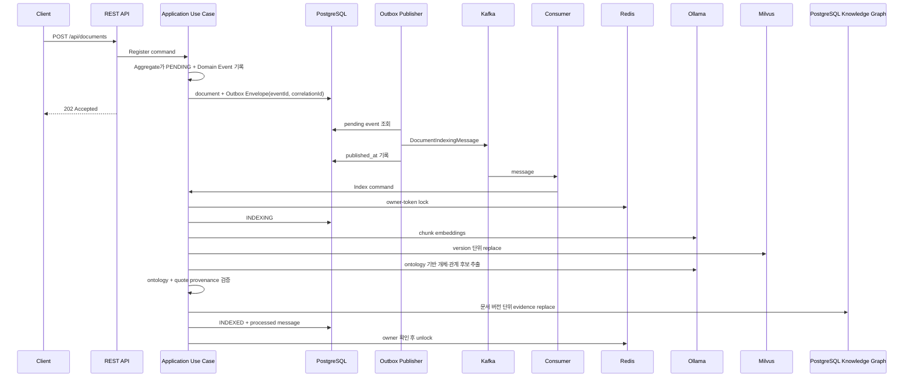
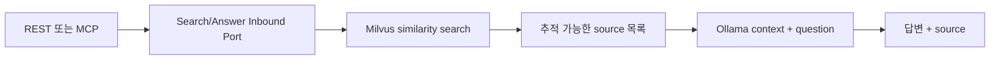

# RAG Target Architecture

## 목적

이 애플리케이션은 원본 지식 문서를 PostgreSQL에 안전하게 보관하고, 비동기 파이프라인으로 Milvus 검색 인덱스를 만든 뒤 REST와 MCP에서 검색 및 근거 기반 답변을 제공한다.

## 구성요소와 데이터 소유권

| 구성요소 | 책임 |
| --- | --- |
| PostgreSQL | 원본 문서, 색인 상태, Transactional Outbox, 처리 완료 메시지, 재생성 가능한 지식 그래프 프로젝션 |
| Milvus | 재생성 가능한 문서 청크와 768차원 embedding 검색 인덱스 |
| Kafka | 문서 색인 요청 전달 |
| Redis | Kafka Consumer의 짧은 owner-token processing lock |
| Ollama | `nomic-embed-text` embedding과 `qwen3.6:27b` 답변 생성 |

PostgreSQL의 `knowledge_documents`가 원문과 업무 상태의 Source of Truth다. PostgreSQL 안의 지식 그래프 테이블과 Milvus는 모두 원문으로부터 다시 만들 수 있는 파생 검색 프로젝션이다. Milvus는 유일한 Vector DB이며, 지식 그래프 테이블은 embedding 검색을 대신하는 두 번째 Vector DB가 아니다.

## 문서 등록과 색인



문서 등록과 Outbox 저장은 하나의 PostgreSQL 로컬 트랜잭션이다. `KnowledgeDocument` Aggregate는 상태 변경이 확정된 뒤 Domain Event를 내부 버퍼에 기록하고, Application은 `pullDomainEvents()`로 꺼낸 이벤트에 `eventId`와 `correlationId`를 가진 Outbox Envelope를 결합한다. Persistence 복원은 과거 이벤트를 다시 기록하지 않는다.

Kafka 발행은 별도 작업이며 실패한 Outbox 레코드는 다음 polling에서 다시 시도한다. 색인 Application Service는 Redis 락으로 동시 중복을 줄이고 `processed_messages(consumer_name, event_id)` 기본 키로 영속 멱등성을 보장한다. Domain Event는 Kafka 및 추적 metadata를 모르며 Kafka Adapter가 Outbox 전달 모델을 wire message로 변환한다.

## 온톨로지와 지식 그래프

초기 도입은 OWL/RDF/SPARQL reasoner가 아니라 `ontology/knowledge-ontology-v1.json`에 둔 경량 버전형 ontology를 사용한다. 이 파일은 실제 사실을 저장하는 데이터베이스가 아니라 LLM이 사용할 수 있는 개체 타입, 관계 타입, 관계의 source/target 타입 조합을 정의하는 문법이다.

그래프 생성은 다음 단계로 분리한다.

1. 문서를 Milvus와 공유하는 동일한 `KnowledgeChunk`로 나눈다.
2. context 한도를 넘지 않도록 설정된 개수의 청크를 Ollama에 전달한다.
3. Ollama가 ontology code, local entity key, confidence, `chunkId`, 원문 `quote`를 가진 JSON 후보를 반환한다.
4. Application validator가 ontology에 없는 타입, 잘못된 관계 끝점, 실제 청크에 존재하지 않는 quote를 거부한다.
5. `ontologyVersion + entityType + normalizedName`으로 같은 개체를 합치고 PostgreSQL 프로젝션을 교체한다.

LLM 출력은 3단계에서는 후보일 뿐이다. 4단계 검증을 통과한 후보만 지식 그래프가 되며, 각 개체와 관계는 원본 `documentId`, `documentVersion`, `chunkId`, `quote`, confidence로 역추적할 수 있다.

```text
knowledge_graph_entities
  └─ knowledge_graph_entity_evidence ──> knowledge_documents

knowledge_graph_relations
  └─ knowledge_graph_relation_evidence ──> knowledge_documents

knowledge_graph_projections ──> 문서별 생성 버전·ontology 버전·건수
```

전역 개체와 관계에서 문서별 evidence를 분리했기 때문에 여러 문서가 같은 개체를 함께 증명할 수 있다. 문서 재색인 또는 삭제 시 해당 문서의 evidence만 제거하고, 어떤 문서에도 근거가 없는 관계를 먼저 삭제한 뒤 고아 개체를 삭제한다.

그래프 기능은 `app.knowledge.graph.enabled=false`가 기본값이다. 기존 Milvus Vector RAG 동작은 이 상태에서 바뀌지 않는다. 운영에서 활성화하면 그래프 추출과 저장도 `INDEXED` 완료 조건이 되며, 실패는 문서를 `FAILED`로 남겨 Kafka/수동 재시도 경로를 사용한다.

## 검색과 RAG



검색 결과는 한 번만 만들고 답변 생성과 source 반환에서 함께 사용한다. Application 계층에는 Spring AI `Document`, Milvus client, Kafka record, Redis template가 노출되지 않는다.

현재 답변 API는 기존 Milvus Vector RAG만 사용한다. 지식 그래프는 아래 읽기 API로 검증·운영 데이터를 축적하며, 측정된 질문 집합에서 vector-only 검색의 한계가 확인된 뒤 GraphRAG/hybrid retrieval 후보 생성기로 연결한다.

- `GET /api/graph/entities?query=...&type=TECHNOLOGY&limit=20`
- `GET /api/graph/entities/{entityId}/neighborhood?depth=1&limit=50`

두 API는 읽기 전용이고 evidence를 함께 반환한다. 초기 범위에는 GraphRAG 답변 합성, Neo4j, pgvector, MCP graph tool, LangGraph4j가 포함되지 않는다.

## 장애 및 재처리

- Outbox 발행 실패: `publish_attempts`, `last_error`를 기록하고 미발행 상태로 유지한다.
- 색인 실패: 문서를 `FAILED`로 기록하고 Kafka listener가 총 3회 시도한다.
- 수동 재시도: `POST /api/documents/{documentId}/retry`가 새 Outbox 이벤트를 만든다.
- 중복 Kafka 메시지: 성공 메시지는 PostgreSQL 처리 이력으로 건너뛴다.
- Milvus 유실: PostgreSQL 원문을 기준으로 실패 문서를 재시도하거나 재색인 Use Case를 확장한다.
- 그래프 추출 실패: 기능이 활성화된 경우 문서를 `FAILED`로 저장하고 같은 색인 재시도 정책을 사용한다.
- ontology 버전 변경: 기존 프로젝션과 version이 다르므로 PostgreSQL 원문에서 전체 재색인한다.

## 관측성

- Actuator: `/actuator/health`, `/actuator/metrics`, `/actuator/prometheus`
- Counter: `knowledge.outbox.delivered`, `knowledge.outbox.delivery.failed`
- Counter: `knowledge.indexing.consumed`, `knowledge.indexing.lock.contention`
- 색인 로그에는 `eventId`와 `documentId`가 포함된다.
