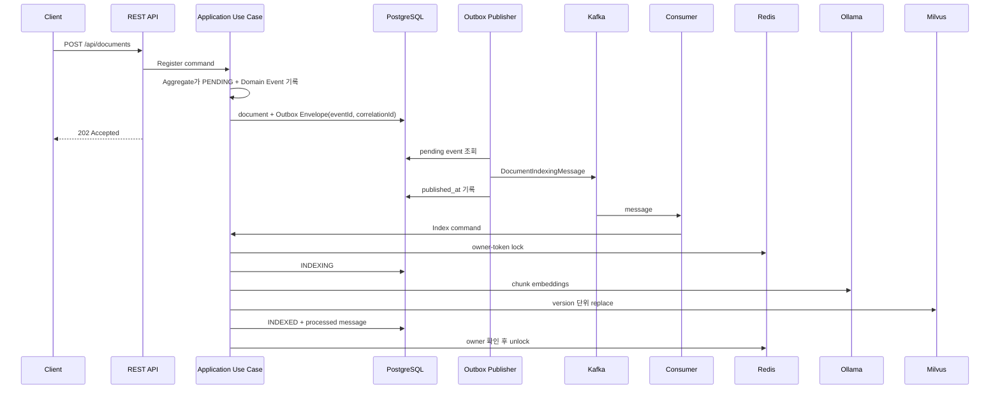
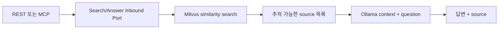

# RAG Target Architecture

## 목적

이 애플리케이션은 원본 지식 문서를 PostgreSQL에 안전하게 보관하고, 비동기 파이프라인으로 Milvus 검색 인덱스를 만든 뒤 REST와 MCP에서 검색 및 근거 기반 답변을 제공한다.

## 구성요소와 데이터 소유권

| 구성요소 | 책임 |
| --- | --- |
| PostgreSQL | 원본 문서, 색인 상태, Transactional Outbox, 처리 완료 메시지 |
| Milvus | 재생성 가능한 문서 청크와 768차원 embedding 검색 인덱스 |
| Kafka | 문서 색인 요청 전달 |
| Redis | Kafka Consumer의 짧은 owner-token processing lock |
| Ollama | `nomic-embed-text` embedding과 `qwen3.6:27b` 답변 생성 |

PostgreSQL이 원문과 업무 상태의 Source of Truth다. Milvus는 유일한 Vector DB지만 원본 저장소는 아니며 PostgreSQL 문서로부터 재구축할 수 있다.

## 문서 등록과 색인

문서 등록과 Outbox 저장은 하나의 PostgreSQL 로컬 트랜잭션이다. `KnowledgeDocument` Aggregate는 상태 변경이 확정된 뒤 Domain Event를 내부 버퍼에 기록하고, Application은 `pullDomainEvents()`로 꺼낸 이벤트에 `eventId`와 `correlationId`를 가진 Outbox Envelope를 결합한다. Persistence 복원은 과거 이벤트를 다시 기록하지 않는다.

Kafka 발행은 별도 작업이며 실패한 Outbox 레코드는 다음 polling에서 다시 시도한다. 색인 Application Service는 Redis 락으로 동시 중복을 줄이고 `processed_messages(consumer_name, event_id)` 기본 키로 영속 멱등성을 보장한다. Domain Event는 Kafka 및 추적 metadata를 모르며 Kafka Adapter가 Outbox 전달 모델을 wire message로 변환한다.

## 검색과 RAG

검색 결과는 한 번만 만들고 답변 생성과 source 반환에서 함께 사용한다. Application 계층에는 Spring AI `Document`, Milvus client, Kafka record, Redis template가 노출되지 않는다.

## 장애 및 재처리

- Outbox 발행 실패: `publish_attempts`, `last_error`를 기록하고 미발행 상태로 유지한다.
- 색인 실패: 문서를 `FAILED`로 기록하고 Kafka listener가 총 3회 시도한다.
- 수동 재시도: `POST /api/documents/{documentId}/retry`가 새 Outbox 이벤트를 만든다.
- 중복 Kafka 메시지: 성공 메시지는 PostgreSQL 처리 이력으로 건너뛴다.
- Milvus 유실: PostgreSQL 원문을 기준으로 실패 문서를 재시도하거나 재색인 Use Case를 확장한다.

## 관측성

- Actuator: `/actuator/health`, `/actuator/metrics`, `/actuator/prometheus`
- Counter: `knowledge.outbox.delivered`, `knowledge.outbox.delivery.failed`
- Counter: `knowledge.indexing.consumed`, `knowledge.indexing.lock.contention`
- 색인 로그에는 `eventId`와 `documentId`가 포함된다.
