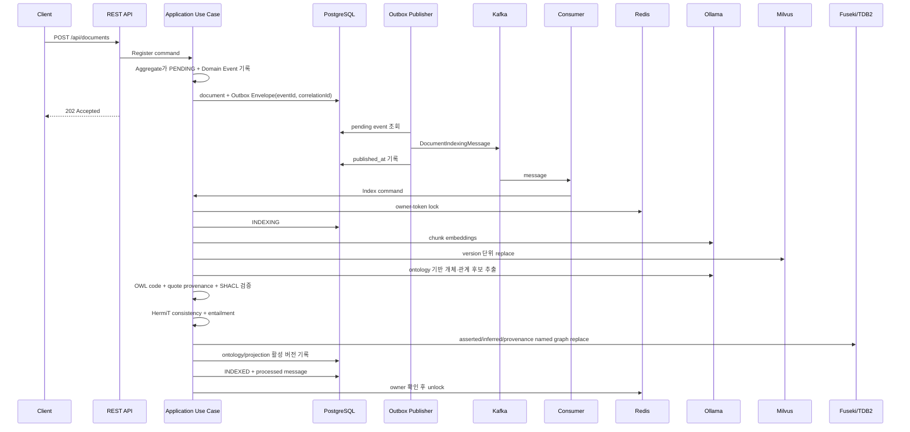
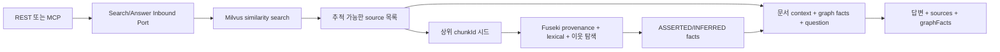

# RAG Target Architecture

## 목적

이 애플리케이션은 원본 지식 문서를 PostgreSQL에 안전하게 보관하고, 비동기 파이프라인으로 Milvus 검색 인덱스를 만든 뒤 REST와 MCP에서 검색 및 근거 기반 답변을 제공한다.

## 구성요소와 데이터 소유권

| 구성요소 | 책임 |
| --- | --- |
| PostgreSQL | 원본 문서, 색인 상태, Transactional Outbox, 처리 완료 메시지, ontology/projection 활성 버전 registry |
| Milvus | 재생성 가능한 문서 청크와 768차원 embedding 검색 인덱스 |
| Kafka | 문서 색인 요청 전달 |
| Redis | Kafka Consumer의 짧은 owner-token processing lock |
| Ollama | `nomic-embed-text` embedding과 `qwen3.6:27b` 답변 생성 |
| Fuseki/TDB2 | OWL ontology, asserted/inferred RDF, statement provenance, SPARQL 조회 |
| HermiT/Jena SHACL | OWL 2 DL 일관성·entailment와 RDF 입력 제약 검증 |

PostgreSQL의 `knowledge_documents`가 원문과 업무 상태의 Source of Truth다. Fuseki 지식 그래프와 Milvus는 모두 원문으로부터 다시 만들 수 있는 파생 검색 프로젝션이다. Milvus는 유일한 Vector DB이며, Fuseki는 RDF 의미 그래프와 SPARQL 저장소이지 embedding 검색을 대신하는 Vector DB가 아니다.

## 문서 등록과 색인



문서 등록과 Outbox 저장은 하나의 PostgreSQL 로컬 트랜잭션이다. `KnowledgeDocument` Aggregate는 상태 변경이 확정된 뒤 Domain Event를 내부 버퍼에 기록하고, Application은 `pullDomainEvents()`로 꺼낸 이벤트에 `eventId`와 `correlationId`를 가진 Outbox Envelope를 결합한다. Persistence 복원은 과거 이벤트를 다시 기록하지 않는다.

Kafka 발행은 별도 작업이며 실패한 Outbox 레코드는 다음 polling에서 다시 시도한다. 색인 Application Service는 Redis 락으로 동시 중복을 줄이고 `processed_messages(consumer_name, event_id)` 기본 키로 영속 멱등성을 보장한다. Domain Event는 Kafka 및 추적 metadata를 모르며 Kafka Adapter가 Outbox 전달 모델을 wire message로 변환한다.

## 온톨로지와 지식 그래프

Semantic 경로는 OWL 2 DL/Turtle, SHACL, HermiT, Jena RDFConnection과 Fuseki/TDB2로 단일화한다. JSON ontology와 PostgreSQL 관계형 그래프 adapter는 제공하지 않으며, PostgreSQL에는 원문과 OWL/Fuseki projection registry만 보존한다.

Ontology는 두 계층으로 배포한다.

```text
knowledge-core-v1.ttl
  ├─ KnowledgeEntity, Agent, Document, DocumentChunk, Concept
  └─ statement evidence, inferred provenance, projection metadata

software-architecture-v1.ttl
  ├─ Technology, Component, Process, DataStore와 세부 subclass
  └─ uses, writesTo, indexedIn, implementsPort 등의 object property
```

`core:code`와 `core:extractable true` annotation을 가진 OWL class/object property만 LLM 추출 문법으로 투영한다. 관계의 허용 source/target 타입은 수동 JSON 배열이 아니라 HermiT가 domain/range에 대한 subclass entailment로 계산한다.

그래프 생성은 다음 단계로 분리한다.

1. 문서를 Milvus와 공유하는 동일한 `KnowledgeChunk`로 나눈다.
2. context 한도를 넘지 않도록 설정된 개수의 청크를 Ollama에 전달한다.
3. Ollama가 ontology code, local entity key, confidence, `chunkId`, 원문 `quote`를 가진 JSON 후보를 반환한다.
4. Application validator가 ontology에 없는 타입, 잘못된 관계 끝점, 실제 청크에 존재하지 않는 quote를 거부한다.
5. RDF reification으로 statement별 document/chunk/quote/confidence provenance를 만든다.
6. Jena SHACL로 필수 필드, datatype, cardinality를 검사한다.
7. HermiT가 TBox+ABox 일관성을 검사하고 superclass/subproperty/inverse entailment를 계산한다.
8. 한 Fuseki transaction에서 문서 버전별 asserted/inferred/provenance named graph와 활성 pointer를 교체한다.
9. PostgreSQL projection registry에 ontology version IRI, checksum, `FUSEKI` backend와 graph IRI를 기록한다.

LLM 출력은 3단계에서는 후보일 뿐이다. 검증을 통과한 직접 진술은 `ASSERTED`, ontology가 함의한 문장은 `INFERRED`로 분리한다. 직접 진술만 원본 quote를 가지며 추론 문장에 가짜 quote를 만들지 않는다.

```text
Fuseki projection catalog
  └─ document version
      ├─ asserted named graph
      ├─ inferred named graph
      └─ provenance named graph ──> documentId/chunkId/quote

PostgreSQL
  ├─ knowledge_ontology_versions
  └─ knowledge_graph_projection_runs
```

문서 재색인 또는 삭제 시 catalog의 해당 문서 활성 pointer와 named graph를 제거하고 활성 union graph를 다시 물질화한다. PostgreSQL 원문과 문서 상태가 기준이므로 Fuseki/TDB2는 전체 재생성할 수 있다.

기존 Flyway V3가 만든 관계형 그래프 테이블은 V5에서 제거한다. 이 테이블들은 파생 프로젝션이므로 원문 문서, Outbox, 처리 완료 메시지, ontology/projection registry에는 영향을 주지 않는다.

그래프 기능은 `app.knowledge.graph.enabled=false`가 기본값이다. 활성화하면 그래프 추출·검증·추론·저장이 `INDEXED` 완료 조건이 되며, 실패는 문서를 `FAILED`로 남겨 Kafka/수동 재시도 경로를 사용한다. 구체적인 OWL 모델과 Protégé 작업 규칙은 `docs/ontology`를 따른다.

## 검색과 RAG



검색 결과와 graph fact는 각각 한 번만 만들고 답변 생성과 응답 반환에서 재사용한다. `QueryKnowledgeService`는 Milvus 상위 결과의 `chunkId`를 graph query에 전달한다. Fuseki Adapter는 같은 provenance를 가진 asserted 사실을 먼저 선택하고, 질문 token과 설정된 0~2단계 이웃 관계로 부족한 context를 보완한다. 시드 개수, 탐색 깊이와 전체 사실 수는 Application policy로 제한한다. Ollama Adapter에는 기술 client가 아닌 parameter object를 전달하며 Application 계층에는 Spring AI `Document`, Jena `Model`, Milvus client, Kafka record, Redis template가 노출되지 않는다.

- `KNOWLEDGE_GRAPH_MAX_SEED_CHUNKS`: Milvus 결과 중 graph provenance 시드로 사용할 최대 청크 수, 기본 8
- `KNOWLEDGE_GRAPH_MAX_HOPS`: 직접 사실 이후 확장할 최대 이웃 깊이, 기본 1, 허용 범위 0~2
- `KNOWLEDGE_GRAPH_MAX_FACTS`: 답변 context에 넣을 최대 그래프 사실 수, 기본 20

- `GET /api/graph/entities?query=...&type=TECHNOLOGY&limit=20`
- `GET /api/graph/entities/{entityId}/neighborhood?depth=1&limit=50`

두 그래프 API는 읽기 전용이며 관계의 `assertionKind`와 asserted evidence를 반환한다. `/api/chat`과 MCP `knowledge_ask`는 동일한 inbound port를 통해 Hybrid GraphRAG를 사용하고 `graphFacts`를 함께 반환한다. Neo4j, pgvector, 별도 graph 마이크로서비스, LangGraph4j는 도입하지 않는다.

## 장애 및 재처리

- Outbox 발행 실패: `publish_attempts`, `last_error`를 기록하고 미발행 상태로 유지한다.
- 색인 실패: 문서를 `FAILED`로 기록하고 Kafka listener가 총 3회 시도한다.
- 수동 재시도: `POST /api/documents/{documentId}/retry`가 새 Outbox 이벤트를 만든다.
- 중복 Kafka 메시지: 성공 메시지는 PostgreSQL 처리 이력으로 건너뛴다.
- Milvus 유실: PostgreSQL 원문을 기준으로 실패 문서를 재시도하거나 재색인 Use Case를 확장한다.
- 그래프 추출/SHACL/OWL 일관성 실패: 기능이 활성화된 경우 문서를 `FAILED`로 저장하고 같은 색인 재시도 정책을 사용한다.
- Fuseki 유실: PostgreSQL 원문과 projection registry를 기준으로 전체 재색인한다.
- ontology 버전 변경: `ReindexKnowledgeDocumentsForOntologyUseCase`가 현재 OWL version과 다른 ACTIVE projection을 찾고 `KnowledgeDocument.requestReindexing()`과 Transactional Outbox로 기존 Kafka 색인 흐름에 다시 접수한다. 공개 관리 API는 만들지 않는다. 기본 비활성 스케줄러는 `KNOWLEDGE_GRAPH_ONTOLOGY_REINDEX_ENABLED=true`일 때만 설정된 배치와 cron으로 이 Use Case를 호출한다.

## 관측성

- Actuator: `/actuator/health`, `/actuator/metrics`, `/actuator/prometheus`
- Counter: `knowledge.outbox.delivered`, `knowledge.outbox.delivery.failed`
- Counter: `knowledge.indexing.consumed`, `knowledge.indexing.lock.contention`
- Counter: `knowledge.graph.ontology.reindex.requested`, `knowledge.graph.ontology.reindex.skipped`
- 색인 로그에는 `eventId`와 `documentId`가 포함된다.

## 비교 연구 환경

운영 경로는 OWL/SHACL/Fuseki와 Milvus를 유지한다. Microsoft GraphRAG와 LightRAG는
`research/graphrag`의 Python 가상환경 및 Docker Compose `research` profile에만 존재하며
Spring Boot runtime이나 Gradle classpath에 포함되지 않는다. 공통 버전형 문서·질문·gold
graph를 사용하고 용어·관계·근거 회수율, 지연시간과 실패 수를 동일 JSONL 계약으로 평가한다.
